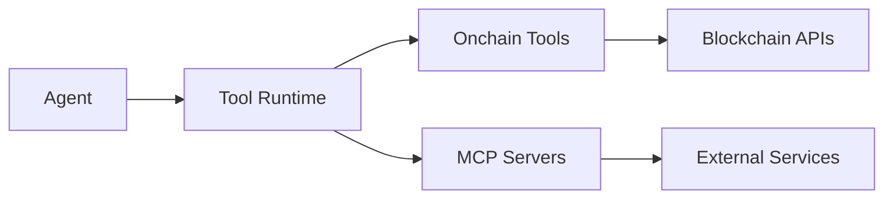

Agents on Compose.Market access external capabilities through connectors. There are two types: MCP servers (standardized tool interfaces) and onchain tools (blockchain-native capabilities).

## MCP servers

MCP servers expose tools through the Model Context Protocol. Bindings use the `mcp:` prefix.

| Connector | Description |
|-----------|-------------|
| `mcp:github` | Repository access, issues, pull requests |
| `mcp:fetch` | HTTP fetch and web retrieval |
| `mcp:filesystem` | Local file read/write operations |
| `mcp:brave-search` | Web search via Brave Search API |

## Onchain tools

Onchain tools provide blockchain-native capabilities. Bindings use the `onchain:` prefix.

| Connector | Description |
|-----------|-------------|
| `onchain:coingecko` | Crypto market data and prices |
| `onchain:uniswap` | DEX token swaps |
| `onchain:erc20` | ERC-20 token transfers, approvals, and queries |
| `onchain:1inch` | DEX aggregation for optimal routing |
| `onchain:ens` | ENS name resolution |
| `onchain:opensea` | NFT marketplace access |
| `onchain:polymarket` | Prediction market trading |

## Using connectors in agents

Specify connectors in the agent card using the `{origin}:{id}` format:

```json
{
  "connectors": [
    { "registryId": "onchain:coingecko", "name": "CoinGecko", "origin": "onchain" },
    { "registryId": "onchain:uniswap", "name": "Uniswap", "origin": "onchain" },
    { "registryId": "mcp:github", "name": "GitHub", "origin": "mcp" },
    { "registryId": "mcp:fetch", "name": "Fetch", "origin": "mcp" }
  ]
}
```

The origin type is `"mcp" | "onchain"`. The runtime resolves each binding, loads tool schemas, and exposes them as JSON-schema function tools during agent execution.

## Transport types

MCP servers can be accessed via different transports:

| Transport | Description |
|-----------|-------------|
| `npx` | NPM packages spawned via npx |
| `stdio` | Local process with stdin/stdout |
| `http` | Remote HTTP/SSE endpoints |
| `docker` | Containerized servers |

## Architecture



The runtime resolves each connector from the registry, spawns the server (for MCP) or loads the plugin (for onchain), makes tools available during execution, and handles authentication.

## Related

- [SDK Tools](/sdk/tools/overview) — tool families, parsing, and the `connectors_find` API
- [Manowar Tools](/manowar/tools/overview) — runtime tool surface and execution model
- [Onchain Tools](/manowar/tools/connectors/onchain-tools) — onchain connector internals
- [MCP Store](/manowar/tools/connectors/mcp-store) — MCP discovery and loading
