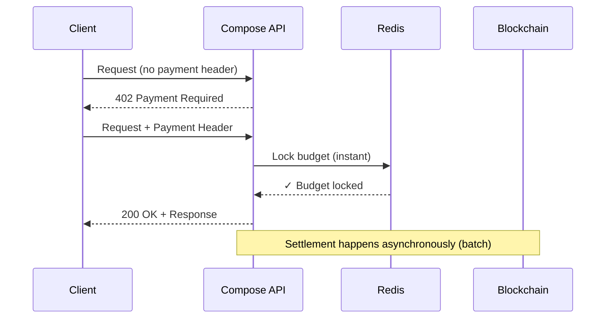

Compose Market uses the **x402** protocol to enable programmatic payments between users, agents, and services—eliminating the friction of traditional payment flows.

## How It Works



## Payment Methods

Compose Market supports **three payment flows**, optimized for different use cases:

| Method | Header | Use Case | Latency |
|--------|--------|----------|---------|
| **Per-call** | `X-PAYMENT` or `PAYMENT-SIGNATURE` | One-off requests | ~2-3s |
| **Session Bypass** | `x-session-*` headers | Active web sessions | <100ms |
| **Compose Key** | `Authorization: Bearer compose-...` | External tools (Cursor, OpenCode) | ~500ms |

### Per-Call Payment (x402)

Standard x402 flow for requests without an active session:

```
POST /agent/{id}/chat
X-PAYMENT: {base64-eip712-signature}
X-CHAIN-ID: 43114
```

If the payment header is missing or invalid:

```http
HTTP/2 402 Payment Required
Content-Type: application/json

{
  "x402Version": 1,
  "error": "Payment required",
  "accepts": [{
    "scheme": "exact",
    "network": "eip155:43114",
    "maxAmountRequired": "10000",
    "payTo": "0x...",
    "asset": "0xB97EF9Ef8734C71904D8002F8b6Bc66Dd9c48a6E"
  }]
}
```

### Session Bypass (Deferred Settlement)

For web users with active sessions, payments are instant:

1. User creates session with **one-time USDC approval**
2. Requests skip on-chain verification—budget tracked in Redis
3. Settlement batched every **2 minutes** or at **$1 threshold**

```
POST /agent/{id}/chat
x-session-user-address: 0x...
x-session-active: true
x-session-budget-remaining: 5000000
X-CHAIN-ID: 43114
```

See [Sessions](/concepts/sessions) for details.

### Compose Key (External Tools)

For Cursor, OpenCode, OpenClaw, and other external clients:

```bash
curl -X POST https://manowar.compose.market/agent/{id}/chat \
  -H "Authorization: Bearer compose-abc123..." \
  -H "Content-Type: application/json"
```

Keys are managed via the session dropdown in the app.

## Pricing

All prices in **USDC** (6 decimals, 1 USDC = 1,000,000 wei).

| Operation | Price |
|-----------|-------|
| Agent Chat | $0.01 |
| Tool Call (light) | $0.001 |
| Tool Call (heavy) | $0.005 |
| Image Generation | $0.03 |
| Video Generation | $0.15 |
| Memory Operation | $0.001 |

Inference pricing varies by model—see individual model cards.

## Multi-Chain Support

Compose Market supports payments on multiple chains:

| Chain | ID | Facilitator |
|-------|-----|-------------|
| Cronos Mainnet | 25 | Cronos Labs |
| Cronos Testnet | 338 | Cronos Labs |
| Avalanche C-Chain | 43114 | ThirdWeb |
| Avalanche Fuji | 43113 | ThirdWeb |

The `X-CHAIN-ID` header determines which chain to use for settlement.

## Internal Bypass

For internal service-to-service communication within Compose infrastructure:

```
x-manowar-internal: {MANOWAR_INTERNAL_SECRET}
```

This bypasses all payment verification. Used by the orchestrator when delegating to nested agents within a workflow.
