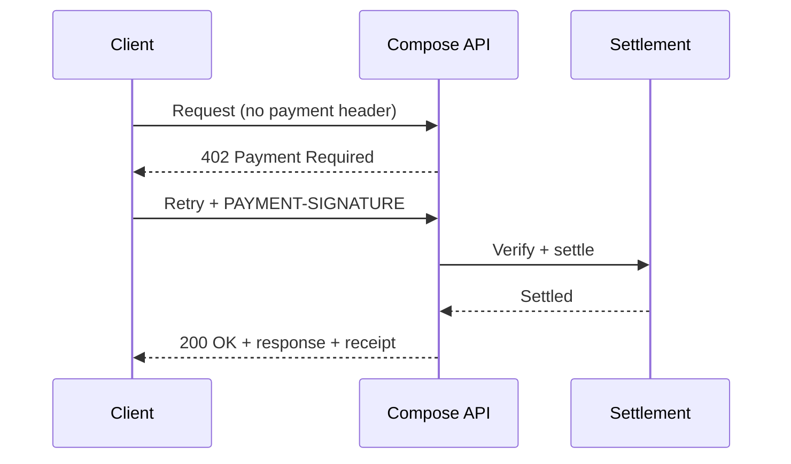

Compose.Market uses the x402 protocol (v2) for machine-to-machine payments. Every paid request follows the same pattern: the API asks for payment, the client pays, the API returns the result.

## The 402 flow


```mermaid
sequenceDiagram
    participant Client
    participant API as Compose API
    participant Settle as Settlement

    Client->>API: Request (no payment header)
    API-->>Client: 402 Payment Required
    Client->>API: Retry + PAYMENT-SIGNATURE
    API->>Settle: Verify + settle
    Settle-->>API: Settled
    API-->>Client: 200 OK + response + receipt
```

## Payment methods

| Method | Header | Use case |
|--------|--------|----------|
| **Compose Key** | `Authorization: Bearer compose-<jwt>` | External tools (OpenCode, Cursor, Cline), first-party app sessions, SDK calls |
| **Raw x402** | `PAYMENT-SIGNATURE` | Wallet-native clients that sign EIP-712 payloads and retry |

### Compose Key

A bearer token that handles payment server-side. The SDK creates and stores it automatically.

```bash
curl https://api.compose.market/external/v1/chat/completions \
  -H "Authorization: Bearer compose-abc123..." \
  -H "Content-Type: application/json" \
  -d '{"model": "gpt-5.5", "messages": [{"role": "user", "content": "Hello"}]}'
```

### Raw x402

For wallet-native clients, the server returns `402` with a `PAYMENT-REQUIRED` header. The client signs and retries with `PAYMENT-SIGNATURE`:

```bash
curl -X POST https://api.compose.market/v1/chat/completions \
  -H "PAYMENT-SIGNATURE: <base64-eip712-signature>" \
  -H "Content-Type: application/json" \
  -d '{"model": "gpt-5.5", "messages": [{"role": "user", "content": "Hello"}]}'
```

The x402 payload uses `x402Version: 2` and an `amount` field.

## x402 schemes

| Scheme | How it works | When to use |
|--------|-------------|-------------|
| **batch-settlement** | Deposit USDC into an on-chain escrow channel once. Each request signs an off-chain voucher. The server claims vouchers in batches. | High-volume repeated calls (agent endpoints). Lowest per-request cost. |
| **exact** | Sign an EIP-3009 transfer for the exact advertised amount. | One-shot calls, no pre-funding. |
| **upto** | Sign a Permit2 authorization for a maximum. The server charges the measured usage after processing. | Usage-metered calls (LLM token billing). |

## Pricing

The API applies a **1% platform fee** on top of the raw provider amount. Pricing is dynamic — each model's price comes from the generated catalog, not a fixed table.

> OpenRouter charges 5.5%. Compose charges 1%. That is a 5.5x difference, and it is factual.

## Multi-chain support

Payments settle in USDC on 6 chains:

| Chain | Chain ID | Type |
|-------|----------|------|
| Avalanche Fuji | 43113 | Testnet |
| Avalanche C-Chain | 43114 | Mainnet |
| Arbitrum Sepolia | 421614 | Testnet |
| Arbitrum One | 42161 | Mainnet |
| Base Sepolia | 84532 | Testnet |
| Base | 8453 | Mainnet |

The `X-CHAIN-ID` header selects the settlement chain. Examples in these docs use `43113` (Fuji).

## Related

- [x402 Facilitator](/x402/introduction) — protocol reference, verify/settle endpoints
- [SDK Payments](/sdk/payments/overview) — TypeScript API for Compose Keys and raw x402
- [Sessions & Keys](/concepts/sessions) — pre-approved spending limits
- [Metering](/inference/metering) — how provider output becomes a bill
