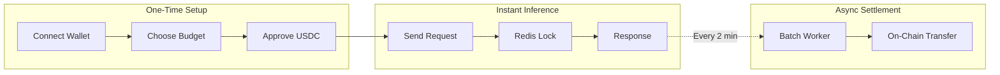

Sessions enable **instant AI inference** by pre-approving a spending limit. One signature, unlimited calls within your budget.

## Overview



## Creating a Session

From the app, click **"Start Session"** in the top bar:

1. **Select Budget** — $1, $5, $10, $25, or $100 USDC
2. **Select Duration** — 1h, 6h, 12h, or 24h
3. **Approve** — One wallet signature to authorize spending

The session is active immediately. All subsequent requests skip wallet signatures.

### What Happens On-Chain

| Chain | Mechanism |
|-------|-----------|
| **Avalanche** | ERC-4337 Session Key + USDC Approval |
| **Cronos** | USDC Approval + Compose Key (EIP-3009) |

The approval authorizes the **treasury wallet** to pull USDC from your smart account, up to your budget limit.

## Using a Session

Once active, requests include session headers automatically:

```
POST /agent/{id}/chat
x-session-user-address: 0x...
x-session-active: true
x-session-budget-remaining: 4500000
X-CHAIN-ID: 43114
```

The server:
1. **Validates** session exists for wallet + chain
2. **Locks** the request amount in Redis (atomic)
3. **Returns** response immediately (<100ms)
4. **Queues** intent for batch settlement

No on-chain verification per request means **instant responses**.

## Deferred Settlement

Instead of settling each micropayment on-chain, Compose Market batches them:

| Trigger | Condition |
|---------|-----------|
| **Timer** | Every 2 minutes |
| **Threshold** | When pending amount ≥ $1.00 |

The batch worker:
1. Reads all pending payment intents from Redis
2. Groups by user + chain
3. Executes **one** USDC `transferFrom` per user
4. Marks intents as settled

If settlement fails, budget is unlocked and the user can retry.

## Compose Keys

For external tools like **Cursor**, **OpenCode**, or **OpenClaw**, generate an **API Key** that inherits your session budget.

### Generate a Key

1. Click the session dropdown → **"Generate API Key"**
2. Name the key (e.g., "Cursor")
3. Copy the token (shown once)

### Use the Key

```bash
curl -X POST https://manowar.compose.market/agent/{id}/chat \
  -H "Authorization: Bearer compose-abc123..." \
  -H "Content-Type: application/json" \
  -d '{"message": "Hello"}'
```

### Key Properties

| Property | Value |
|----------|-------|
| Format | `compose-{base64-jwt}` |
| Budget | Inherits from session |
| Expiry | Same as session |
| Revocable | Yes, from "Manage Sessions" |

Keys are **JWT tokens** containing the user wallet, budget limit, and expiration. Each request deducts from the key's budget.

## API Endpoints

### Create Key

```
POST /api/keys
Headers:
  x-session-user-address: 0x...
  x-session-active: true

Body:
{
  "budgetLimit": 5000000,
  "expiresAt": 1738500000000,
  "name": "Cursor"
}

Response:
{
  "keyId": "abc-123",
  "token": "compose-...",
  "budgetLimit": 5000000,
  "expiresAt": 1738500000000
}
```

### List Keys

```
GET /api/keys
Headers:
  x-session-user-address: 0x...

Response:
{
  "keys": [{
    "keyId": "abc-123",
    "budgetLimit": 5000000,
    "budgetUsed": 150000,
    "expiresAt": 1738500000000,
    "name": "Cursor"
  }]
}
```

### Revoke Key

```
DELETE /api/keys/{keyId}
Headers:
  x-session-user-address: 0x...

Response: 204 No Content
```

### Get Settlement Status

```
GET /api/settlement/status
Headers:
  x-session-user-address: 0x...
  X-CHAIN-ID: 43114

Response:
{
  "totalWei": "10000000",
  "lockedWei": "500000",
  "usedWei": "4500000",
  "availableWei": "5000000",
  "pendingIntents": 3
}
```

## Security Model

| Layer | Protection |
|-------|------------|
| **Session** | Wallet signature required to create |
| **Budget** | Atomic Redis locking prevents over-spend |
| **Settlement** | On-chain USDC approval limits max exposure |
| **Keys** | JWT signed with server secret, revocable |

The worst-case exposure is the **session budget**—funds can only be pulled up to the approved amount, and only to the treasury wallet.
