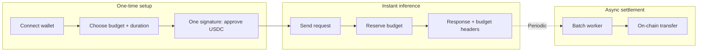

Sessions enable instant AI inference by pre-approving a spending limit. One wallet signature, unlimited calls within budget — no per-request signing.

## How it works


```mermaid
flowchart LR
    subgraph "One-time setup"
        A[Connect wallet] --> B[Choose budget + duration]
        B --> C[One signature: approve USDC]
    end
    subgraph "Instant inference"
        D[Send request] --> E[Reserve budget]
        E --> F[Response + budget headers]
    end
    subgraph "Async settlement"
        G[Batch worker] --> H[On-chain transfer]
    end
    C --> D
    F -.->|Periodic| G
```

## Creating a session

From the app, click **Start Session**:

1. **Select budget** — $1, $5, $10, $25, or $100 USDC.
2. **Select duration** — 1h, 6h, 12h, or 24h.
3. **Approve** — one wallet signature authorizes the treasury to pull USDC up to your budget.

The session is active immediately. All subsequent requests skip wallet signatures.

## Compose Keys

A Compose Key is a signed JWT that inherits a session budget (or stands alone with its own budget). Format: `compose-{base64-jwt}`.

### Generate a key

```http
POST /api/keys
Authorization: Bearer compose-...

{ "budgetLimit": 1000000, "expiresAt": 1790000000000, "chainId": 43113, "purpose": "api", "name": "OpenCode" }
```

Requires `budgetLimit`, `expiresAt`, `chainId`, and `purpose` (`"api"` or `"session"`). The API checks USDC funding before creating the key. Response includes `keyId`, `token`, and budget state.

### Use and revoke

```bash
curl https://api.compose.market/external/v1/chat/completions \
  -H "Authorization: Bearer compose-..." \
  -d '{"model": "gpt-5.5", "messages": [{"role": "user", "content": "Hello"}]}'
```

Revoke with `DELETE /api/keys/{keyId}` and `Authorization: Bearer compose-...`. Revocation uses signed key ownership — the bearer key must belong to the same wallet as the target key.

## Budget headers

Every billable response includes live budget headers:

| Header | Meaning |
|--------|---------|
| `x-key-budget-limit` | Original budget |
| `x-key-budget-used` | Settled amount recorded against the key |
| `x-key-budget-remaining` | Spendable budget left |
| `x-payment-method` | `session` for active session requests |
| `x-session-invalid` | Reason a session key no longer works (`expired`, `budget-depleted`, `revoked`) |

## Live budget tracking

The SDK parses budget headers and emits a `budget` event on every paid response:

```typescript
sdk.events.on("budget", (event) => {
  console.log(`Used: ${event.snapshot.usedWei} wei`);
  console.log(`Remaining: ${event.snapshot.remainingWei} wei`);
});
```

## Deferred settlement

Instead of settling each micropayment on-chain, the batch worker groups pending intents by user and chain, then executes one USDC `transferFrom` per group. If settlement fails, budget is unlocked and the user can retry.

## Security model

| Layer | Protection |
|-------|------------|
| Session creation | Wallet signature required |
| Budget | Atomic reservation prevents over-spend |
| Settlement | On-chain USDC approval limits max exposure |
| Keys | JWT signed with server secret, revocable via signed ownership |

Worst-case exposure is the session budget — funds can only be pulled up to the approved amount, and only to the treasury wallet.

## Related

- [x402: Sessions](/x402/sessions) — protocol details, session state, and events
- [SDK: Sessions](/sdk/payments/sessions) — SDK API for budget tracking and session lifecycle
- [x402 Payments](/concepts/payments) — payment methods and x402 schemes
