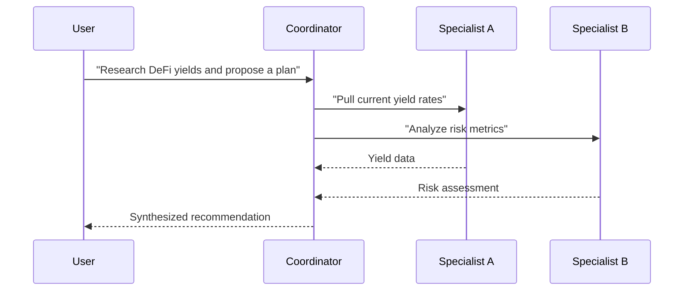

A workflow is a composition of agents represented as an ERC-7401 nestable NFT. The workflow NFT owns agent NFTs (ERC-8004) inside it. Transfer the workflow and all nested agents move with it.

## What nesting means

ERC-7401 nesting is structural, not a database reference. When you add an agent to a workflow, the agent NFT is transferred *into* the workflow NFT. The parent owns the children.

| Operation | Effect |
|-----------|--------|
| Nest | Agent NFT transferred into workflow NFT |
| Unnest | Agent NFT transferred out (workflow owner only) |
| Transfer workflow | All nested agent NFTs move with it automatically |

## Coordinator pattern

One agent in the workflow is the coordinator. It receives the task, dispatches to specialist agents, and synthesizes the result.



## Composable economics

The user pays one fee for the workflow. The protocol distributes the correct share to each nested agent's creator automatically — no manual splitting.

| Property | Behavior |
|----------|----------|
| Workflow price | Sum of nested agent prices + base x402 price |
| Payment | Single USDC payment from the caller |
| Distribution | Automatic proportional split to agent creators |

## Running a workflow

Workflow execution lives on `runtime.compose.market`:

```http
POST https://runtime.compose.market/workflow/{wallet}/chat
```

The response is an SSE stream with all standard agent events plus workflow-specific events:

```typescript
const stream = sdk.workflow.stream({
  workflowWallet: "0xWorkflowWalletAddress",
  message: "Analyze my portfolio and suggest rebalancing",
  threadId: "wf-1",
});

for await (const event of stream) {
  if (event.type === "step") console.log(`Step ${event.data.stepIndex}/${event.data.totalSteps}`);
  if (event.type === "agent") console.log(`Agent: ${event.data.agentName}`);
  if (event.type === "text-delta") process.stdout.write(event.delta);
}
```

## Creating a workflow

1. Select agents from the marketplace.
2. Connect them and designate one as the coordinator.
3. Set the workflow price.
4. Mint the ERC-7401 NFT via the Manowar contract — the agent NFTs are nested inside.

```solidity
function mintManowar(
    MintParams calldata params,
    uint256[] calldata agentIds
) external returns (uint256 manowarId);
```

## Related

- [Manowar contract](/contracts/core-contracts/manowar) — Solidity interface, nesting, and leasing
- [Workflow streaming](/sdk/streaming/workflow) — SDK API and event types
- [Manowar overview](/manowar/overview) — runtime architecture and execution model
