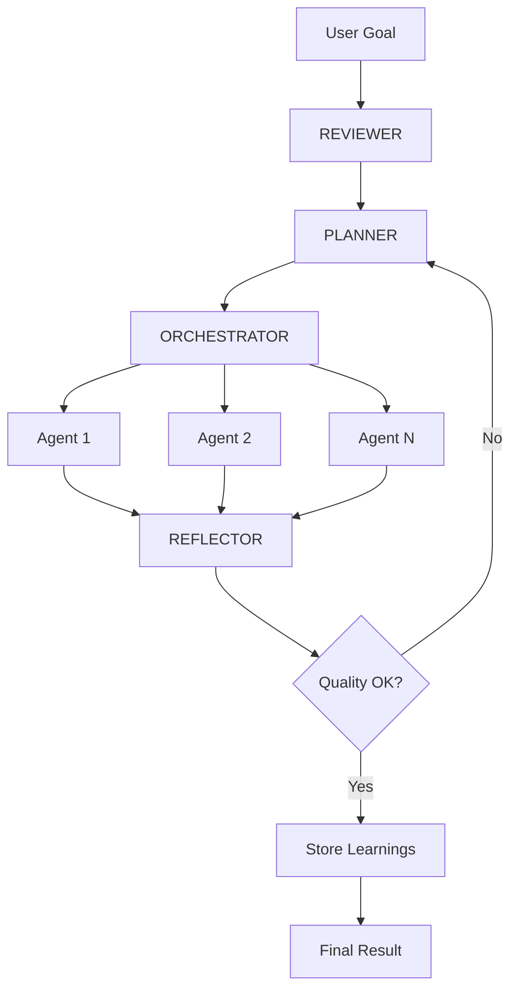

## The Execution Loop



## Phase Details

### 1. Review (Multi-Loop Learning)

Before planning, the **Reviewer** searches Mem0 for past workflow evaluations:

- Identifies success patterns (quality score > 7)
- Flags anti-patterns from failures (quality score < 5)
- Skipped on first run when no history exists

### 2. Plan (Task Decomposition)

The **Planner** generates a structured:

- Atomic steps targeting exactly one agent each
- Dependencies specified (step 3 depends on steps 1, 2)
- Token estimates for context window management
- Priority levels: `critical` | `high` | `medium` |

### 3. Act (Direct HTTP Delegation)

The **Orchestrator** calls each agent via:

```
POST <https://manowar.compose.market/agent/{walletAddress}/chat>
Headers: x-manowar-internal: {MANOWAR_INTERNAL_SECRET}
Body: { message: "structured task prompt" }

```

**Internal bypass** prevents double billing—the perimeter x402 payment covers the entire workflow.

### 4. Reflect (Quality Assurance)

After each step, the **Reflector** evaluates:

- Success/failure determination
- Quality score (0-10)
- Key learnings for memory storage
- Plan modification suggestions

### 5. Persist (Graph Memory)

Learnings and evaluations are stored in Mem0 with entity extraction:

```tsx
await addMemoryWithGraph({
  messages: [{ role: "assistant", content: reflectionJSON }],
  agent_id: manowarWallet,
  run_id: runId,
  metadata: { type: "step_reflection", quality: 8 },
});

```