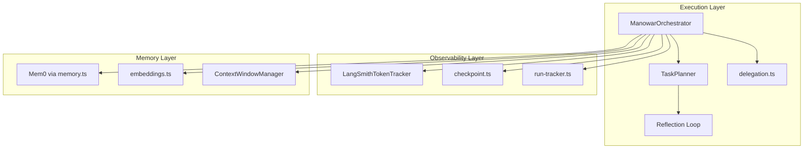

Manowar is a production-grade orchestration framework designed for **fully autonomous, continuous workflows**. It coordinates specialized agents through a unified execution loop with integrated observability, memory management, and context window optimization.

## Architectural Overview

The framework consists of three main layers:



### Execution Flow

1. **Initialize**: Fetch `manowarCard` from IPFS, build coordinator system prompt
2. **Plan**: `TaskPlanner` decomposes goal into atomic steps with dependencies
3. **Execute**: Delegate each step to specialized agents via HTTP
4. **Track**: Record token usage, checkpoints, and metrics
5. **Reflect**: Evaluate quality and adjust plan if needed
6. **Persist**: Store learnings and complete run tracking

# The Thing, Not the Tool

Manowar is an **execution factory** that turns user goals into coordinated multi-agent operations. Tools require human operation; Manowar operates autonomously once deployed.

## From Tooling to Agency

| Traditional AI Tools | Manowar Agentic System |
| --- | --- |
| User issues prompts | User defines goals |
| AI suggests actions | System executes workflows |
| Human validates each step | Agents validate each other |
| Session-bound context | Persistent cross-run memory |
| Pay for capacity | Pay for outcomes |

## The Manowar Identity

A **Manowar** is a deployable workflow NFT—an on-chain entity with:

- **Embedded Agent Cards**: Component agents with specific skills, models, and plugins
- **Execution Graph**: Directed edges defining agent collaboration order
- **Coordinator Model**: A reasoning-optimized LLM (Nemotron, Kimi K2, MiniMax M2.1, …) orchestrating all operations
- **Derived Wallet**: Cryptographic identity for on-chain settlement and memory addressing

```
manowarCard (IPFS)
├── agents[]           # Component AgentCards with walletAddress, model, skills
├── edges[]            # Execution graph: Agent 0 → Agent 1 → Agent 2
├── coordinator        # { model: "minimax/minimax-m2.1", hasCoordinator: true }
└── walletAddress      # Primary identifier: 0x...
```

## Module Structure

The framework consists of 13 production modules. See the [Module Reference](/framework/modules) for complete documentation of each module's responsibilities and interfaces.

| Category | Modules |
|----------|---------|
| **Orchestration** | `orchestrator.ts`, `planner.ts`, `delegation.ts` |
| **Observability** | `langsmith.ts`, `checkpoint.ts`, `run-tracker.ts` |
| **Context & Memory** | `context.ts`, `memory.ts`, `embeddings.ts` |
| **Configuration** | `registry.ts`, `agentic.ts`, `triggers.ts`, `types.ts` |
