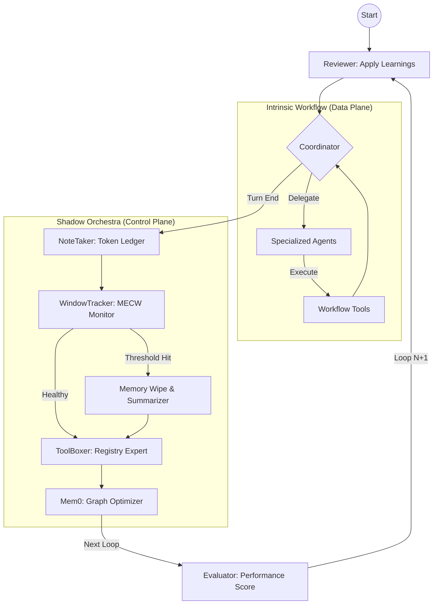

Manowar is a production-grade orchestration framework designed for **fully autonomous, continuous workflows**. It leverages a dual-plane architecture that separates the execution of tasks from the maintenance of the agent's cognitive health.

## 1. Architectural Philosophy: The Dual-Plane Model

The framework operates on the principle of separating the **Data Plane** from the **Control Plane**.\

*   **Intrinsic Workflow (The Data Plane):** The "Main Stage" where specialized agents execute immutable, on-chain defined tasks using a fixed set of tools.\
*   **Extrinsic Orchestration (The Control Plane):** The "Shadow Orchestra." A suite of background sub-agents (NoteTaker, WindowTracker, ToolBoxer) that monitor performance, manage context windows, and optimize the workflow without interfering with the task's logic.\

### High-Level Orchestration Flow



# The Thing, Not the Tool

Manowar is an **execution factory** that turns user goals into coordinated multi-agent operations. Tools require human operation; Manowar operates autonomously once deployed.

## From Tooling to Agency

| Traditional AI Tools | Manowar Agentic System |
| --- | --- |
| User issues prompts | User defines goals |
| AI suggests actions | System executes workflows |
| Human validates each step | Agents validate each other |
| Session-bound context | Persistent cross-run memory |
| Pay for capacity | Pay for outcomes |

## The Manowar Identity

A **Manowar** is a deployable workflow NFT—an on-chain entity with:

- **Embedded Agent Cards**: Component agents with specific skills, models, and plugins
- **Execution Graph**: Directed edges defining agent collaboration order
- **Coordinator Model**: A reasoning-optimized LLM (Nemotron, Kimi K2, MiniMax M2.1, …) orchestrating all operations
- **Derived Wallet**: Cryptographic identity for on-chain settlement and memory addressing

```
manowarCard (IPFS)
├── agents[]           # Component AgentCards with walletAddress, model, skills
├── edges[]            # Execution graph: Agent 0 → Agent 1 → Agent 2
├── coordinator        # { model: "minimax/minimax-m2.1", hasCoordinator: true }
└── walletAddress      # Primary identifier: 0x...

```
