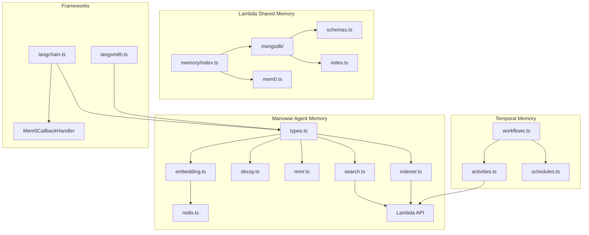
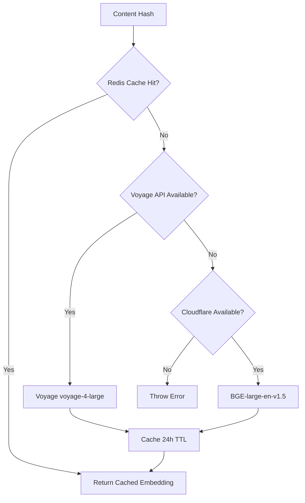
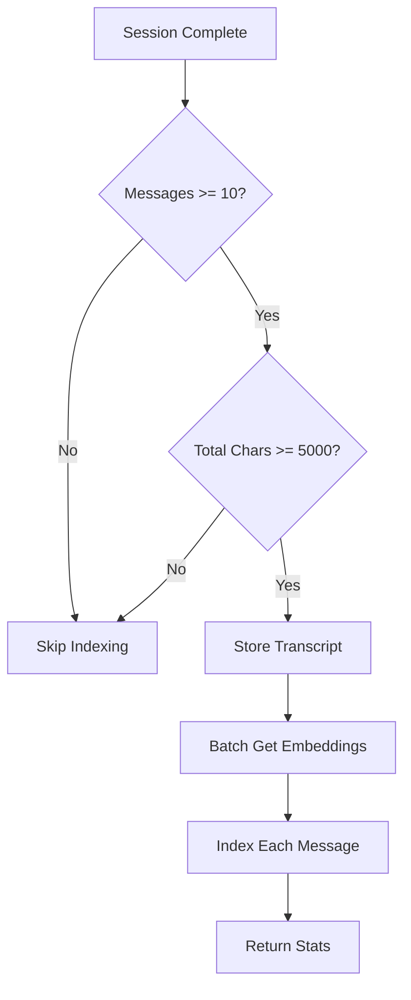
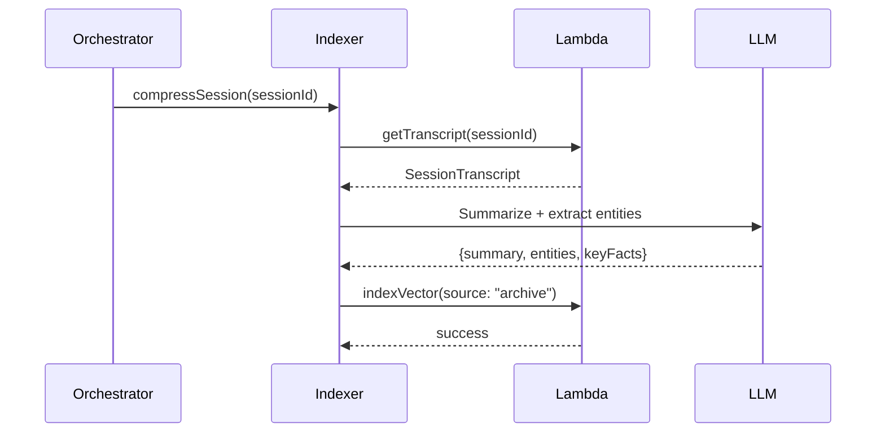

## Module Architecture



---

## Embedding Pipeline

### Provider Priority



### Cache Strategy

| Aspect | Implementation |
|--------|----------------|
| Key | `embedding:{sha256(content).slice(0,32)}` |
| TTL | 24 hours (86400s) |
| Value | `{ embedding: number[], provider: "voyage" \| "cloudflare" }` |
| Hit Rate | ~70-90% for repeated queries |

---

## Hybrid Search Flow

### Step 1: Query Embedding

```typescript
const queryEmbedding = await getEmbedding(query);
// Returns: { embedding: number[], provider: string, cached: boolean }
```

### Step 2: Lambda Vector Search

```typescript
// manowar calls Lambda
const response = await fetch(`${LAMBDA_API_URL}/api/memory/vector-search`, {
    method: "POST",
    body: JSON.stringify({
        query,
        queryEmbedding: queryEmbedding.embedding,
        agentWallet,
        userId,
        threadId,
        limit: limit * 2,
    }),
});
```

### Step 3: MongoDB Atlas Query

```typescript
// lambda/shared/memory/index.ts
const pipeline = [
    { $vectorSearch: {
        index: "vector_index",
        path: "embedding",
        queryVector: params.queryEmbedding,
        numCandidates: limit * 10,
        limit: limit * 2,
        filter: { agentWallet, userId, threadId }
    }},
    { $addFields: { rawScore: { $meta: "vectorSearchScore" } } },
    { $addFields: { adjustedScore: { $multiply: ["$rawScore", "$decayScore"] } } },
    { $match: { adjustedScore: { $gte: threshold } } },
    { $sort: { adjustedScore: -1 } },
    { $limit: limit }
];
```

### Step 4: Client-Side Processing

```typescript
// manowar/src/agent/memory/search.ts
let results = data.results;

// Apply temporal decay (additional client-side)
if (temporalDecay) {
    results = applyDecayToResults(results, {
        enabled: true,
        halfLifeDays: 30,
    });
}

// Apply reranking via Lambda
if (rerank) {
    results = await applyReranking(query, results);
}

// Apply MMR for diversity
if (mmr) {
    results = mmrRerank(results, { enabled: true, lambda: mmrLambda });
}

return results.slice(0, limit);
```

---

## Session Indexing Flow

### Trigger Conditions

Sessions are indexed when **both** thresholds are met:
- `messages.length >= 10`
- `totalChars >= 5000`



### Indexing Implementation

```typescript
// manowar/src/agent/memory/indexer.ts
export async function indexSessionTranscript(params) {
    // 1. Check thresholds
    if (messages.length < 10 || totalChars < 5000) {
        return { indexed: false };
    }

    // 2. Store transcript to MongoDB
    await fetch(`${LAMBDA_API_URL}/api/memory/transcript-store`, {
        method: "POST",
        body: JSON.stringify({ sessionId, threadId, agentWallet, messages, ... }),
    });

    // 3. Get embeddings for all user/assistant messages
    const contents = messages
        .filter(m => m.role === "user" || m.role === "assistant")
        .map(m => m.content);
    const embeddings = await getEmbeddingsBatch(contents);

    // 4. Index each message as separate vector
    for (let i = 0; i < messages.length; i++) {
        await indexMemoryContent({
            content: messages[i].content,
            agentWallet,
            threadId,
            source: "session",
            metadata: { sessionId, role, timestamp, messageIndex: i },
        });
    }

    return { indexed: true, messageCount, vectorCount };
}
```

---

## MMR Algorithm

### Purpose
Maximal Marginal Relevance balances relevance with diversity in search results.

### Formula
```
MMR = λ × relevance - (1 - λ) × max_similarity_to_selected
```

Where:
- `λ` (lambda): Balance parameter (default: 0.7)
- `relevance`: Normalized search score
- `max_similarity`: Maximum Jaccard similarity to any already-selected result

### Implementation Modes

**Precise Mode** (≤100 results):
- Full greedy selection
- O(n²) complexity
- Optimal diversity

**Fast Mode** (>100 results):
- Batch processing (20 items/batch)
- Limited comparison window (15 selected items max)
- Early termination on high similarity (>0.8)
- O(n log n) amortized

```typescript
// manowar/src/agent/memory/mmr.ts
export function mmrRerank(results, config) {
    if (results.length > 100) {
        return mmrRerankFast(results, lambda);  // Optimized
    }
    return mmrRerankPreciseInternal(results, lambda);  // Accurate
}
```

### Lambda Tuning

| Lambda | Effect | Use Case |
|--------|--------|----------|
| 0.9 | High relevance, low diversity | Precise answers |
| 0.7 (default) | Balanced | General search |
| 0.5 | Equal weight | Exploration |
| 0.3 | High diversity | Discovery |
| 1.0 | Pure relevance sort | No diversity needed |

---

## Temporal Decay

### Decay Formula

```typescript
// manowar/src/agent/memory/decay.ts
export function calculateDecayMultiplier(ageInDays, halfLifeDays) {
    const lambda = Math.LN2 / halfLifeDays;
    return Math.exp(-lambda * ageInDays);
}

// Example: 30-day half-life
// Day 0:  decayScore = 1.0
// Day 30: decayScore = 0.5
// Day 60: decayScore = 0.25
// Day 90: decayScore = 0.125
```

### Application Points

1. **MongoDB Query**: `adjustedScore = rawScore × decayScore`
2. **Manowar Post-Process**: `applyDecayToResults()` for client-side re-ranking

### Half-Life Configuration

```typescript
const config: TemporalDecayConfig = {
    enabled: true,
    halfLifeDays: 30,  // Default
};
```

| Half-Life | 90-day retention | Use Case |
|-----------|------------------|----------|
| 7 days | 1.6% | Short-term memory |
| 30 days | 12.5% | Default |
| 90 days | 50% | Long-term knowledge |
| 365 days | 87% | Persistent facts |

---

## Session Compression

### Trigger
Manual call or context window pressure.

### Flow



### Implementation

```typescript
// manowar/src/agent/memory/indexer.ts
export async function compressSession(params) {
    const transcript = await getSessionTranscript(params);
    
    const summaryPrompt = `Summarize this conversation:
${transcript.messages.map(m => `${m.role}: ${m.content}`).join("\n")}
Respond with JSON: { "summary", "entities", "keyFacts" }`;
    
    const response = await fetch(`${LAMBDA_API_URL}/api/inference`, {
        method: "POST",
        body: JSON.stringify({ model, messages: [{ role: "user", content: summaryPrompt }] }),
    });
    
    const parsed = JSON.parse(jsonMatch[0]);
    
    await indexMemoryContent({
        content: parsed.summary,
        source: "archive",
        metadata: { keyFacts: parsed.keyFacts },
    });
    
    return { summary: parsed.summary, entitiesExtracted: parsed.entities.length };
}
```