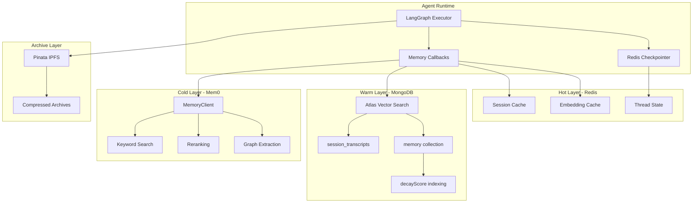
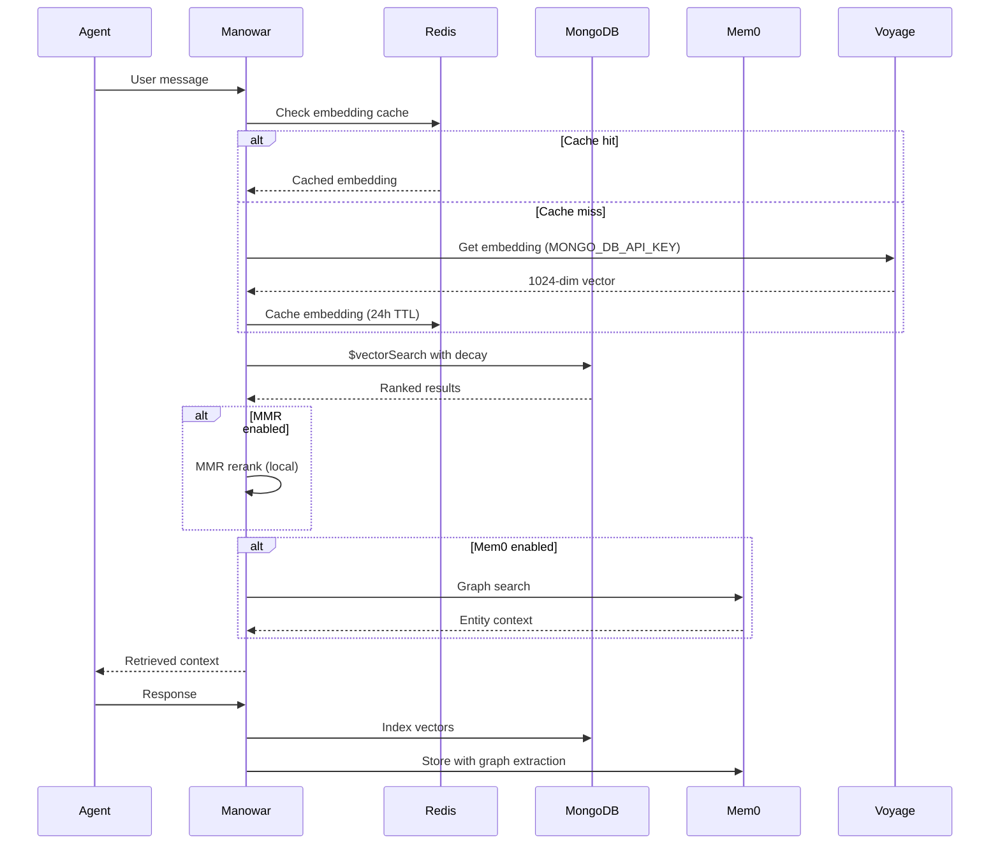

## Overview

The memory system provides **infinite context** for autonomous agents through a multi-layer architecture:

- **Hot Layer**: Redis for checkpoints, embedding cache, session state
- **Warm Layer**: MongoDB Atlas Vector Search for semantic retrieval
- **Cold Layer**: Mem0 for entity/fact extraction, graph relations, long-term memory
- **Archive Layer**: IPFS via Pinata for compressed historical archives

## Key Capabilities

| Capability | Implementation | Provider |
|------------|----------------|----------|
| Vector Search | 1024-dim cosine similarity | MongoDB Atlas |
| Embeddings | voyage-4-large, BGE fallback | Voyage AI / Cloudflare |
| Semantic Cache | Content-hash keyed TTL | Redis |
| Checkpointing | LangGraph state persistence | Redis |
| Entity Extraction | Graph-enabled memory | Mem0 |
| Temporal Decay | Half-life scoring (default: 30 days) | MongoDB |
| MMR Reranking | Diversity optimization | Manowar (local) |
| Long-term Storage | IPFS pinning | Pinata |

## Data Flow

