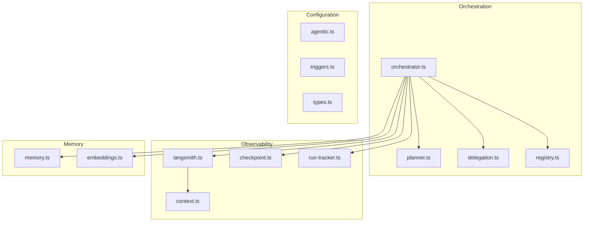
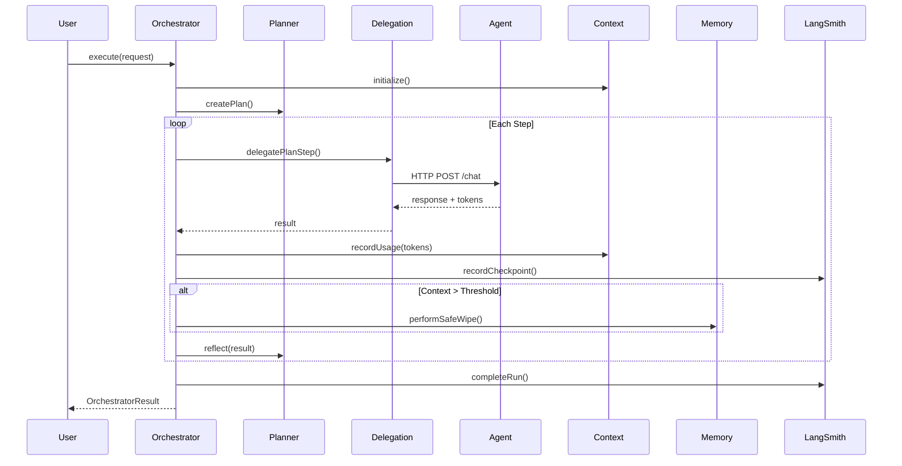

## Module Architecture

Manowar consists of 13 production modules that work together to provide autonomous workflow execution.



---

## Core Modules

### orchestrator.ts
**Role:** Main execution engine  
**Lines:** ~730

Coordinates the entire workflow execution loop:
1. Initializes from `manowarCard` (fetched via `registry.ts`)
2. Creates execution plan via `TaskPlanner`
3. Delegates steps to agents via `delegation.ts`
4. Tracks tokens via `ContextWindowManager`
5. Performs safe wipes when context threshold exceeded
6. Records checkpoints and persists to LangSmith

**Key exports:**
- `ManowarOrchestrator` — Main orchestrator class
- `executeWithOrchestrator()` — Convenience function

**Imports from:**
`planner.ts`, `delegation.ts`, `registry.ts`, `context.ts`, `memory.ts`, `embeddings.ts`, `langsmith.ts`, `checkpoint.ts`, `run-tracker.ts`, `agentic.ts`

---

### planner.ts
**Role:** Task decomposition and reflection  
**Lines:** ~850

Handles the Plan → Reflect loop:
- `TaskPlanner` class generates structured execution plans
- Reflection evaluates step outputs and suggests modifications
- Review phase incorporates learnings from previous runs

**Key exports:**
- `TaskPlanner` — Planning and reflection coordinator
- `plannerSystemPrompt`, `reflectorSystemPrompt`, `reviewerSystemPrompt`
- `ExecutionPlan`, `PlanStep`, `StepReflection` types

---

### delegation.ts
**Role:** HTTP delegation to agents  
**Lines:** ~180

Delegates tasks to registered agents via HTTP:

```
POST https://manowar.compose.market/agent/{walletAddress}/chat
Headers: x-manowar-internal: {MANOWAR_INTERNAL_SECRET}
```

Internal bypass (`internalSecret`) prevents double-billing for orchestrator-initiated calls.

**Key exports:**
- `callAgent()` — Low-level HTTP call
- `delegatePlanStep()` — High-level step delegation with context

---

## Observability Modules

### langsmith.ts
**Role:** Token tracking and LangSmith integration  
**Lines:** ~640

The observability hub:
- Unified token extraction from any LLM response format
- `LangSmithTokenTracker` callback handler
- Dataset recording for learnings
- Feedback recording for quality scores

**Key exports:**
- `extractTokens()`, `extractTokenUsage()` — Token extraction
- `LangSmithTokenTracker` — LangChain callback handler
- `recordLearning()`, `recordQualityScore()` — Dataset integration

**Imports from:** `context.ts` (type only: `TokenCheckpoint`)

---

### checkpoint.ts
**Role:** Execution annotation engine  
**Lines:** ~250

Records execution checkpoints for observability:

| Function | Purpose |
|----------|---------|
| `recordObservation()` | What the agent perceived |
| `recordInsight()` | Learnings from step reflection |
| `recordDecision()` | Choices made and reasoning |
| `recordError()` | Failure modes for pattern avoidance |
| `persistCheckpoints()` | Batch persist to Mem0 |

---

### run-tracker.ts
**Role:** Run lifecycle management  
**Lines:** ~280

Tracks execution runs from start to finish:
- `createRun()` — Initialize tracked run
- `startRun()` — Mark as running
- `completeRun()` — Mark as success with metrics
- `failRun()` — Mark as failed with error
- `getRun()`, `listRuns()` — Query runs
- Cron execution tracking for triggers

**Key exports:**
- `TrackedRun` type with status: `pending | running | success | error | cancelled`
- `recordCronExecution()`, `getCronStats()`

---

## Context & Memory Modules

### context.ts
**Role:** Context window tracking  
**Lines:** ~400

Manages per-agent token usage and context window limits:
- Fetches model context window from API
- Tracks cumulative token usage per agent
- Triggers cleanup when threshold exceeded
- Implements `TokenLedgerInterface` for `LangSmithTokenTracker`

**Key exports:**
- `ContextWindowManager` — Main tracking class
- `getModelContextSpec()` — Fetch model limits
- `getDynamicThresholdPercent()` — Threshold formula

**Dynamic threshold formula:**
```
Threshold = 55% + 0.5 × log₁₀(contextWindow / 1024)
```

---

### memory.ts
**Role:** Mem0 Platform API integration  
**Lines:** ~800

Handles all Mem0 memory operations:
- `addMemoryWithGraph()` — Store with entity extraction
- `searchMemoryWithGraph()` — Semantic + keyword search
- `getContextualMemory()` — Priority cascade (user → agent → run)
- `performSafeWipe()` — Context compression with summarization

**Memory Priority Matrix:**

| Priority | Scope | Use Case |
|----------|-------|----------|
| 1 | `user_id` | Personalization |
| 2 | `agent_id` | Cross-run patterns |
| 3 | `run_id` | Within-run context |

---

### embeddings.ts
**Role:** Semantic similarity and retrieval  
**Lines:** ~150

Handles embedding-based context retrieval:
- `computeEmbedding()` — Generate embeddings via `e5-mistral-7b-instruct`
- `storeEmbedding()` — Persist to vector store
- `getRelevantContext()` — Retrieve similar context for task
- `recordConversationTurn()` — Store conversation for retrieval

---

## Configuration Modules

### registry.ts
**Role:** ManowarCard fetching and system prompt construction  
**Lines:** ~200

Fetches workflow configuration from IPFS:
- `fetchManowarCard()` — Retrieve and cache manowarCard
- `buildSystemPromptFromCard()` — Construct coordinator system prompt

---

### agentic.ts
**Role:** Approved coordinator model list  
**Lines:** ~95

Curated list of models suitable for agentic coordination:

```typescript
export const coordinatorModels = [
    'nvidia/llama-3.1-nemotron-70b-instruct',
    'moonshotai/kimi-k2-instruct',
    'minimax/minimax-m2.1',
    // ... additional approved models
];
```

**Key exports:**
- `coordinatorModels` — Array of approved model IDs
- `isAgenticCoordinatorModel()` — Validation function
- `getDefaultCoordinatorModel()` — Get recommended default

---

### triggers.ts
**Role:** Cron-based workflow scheduling  
**Lines:** ~400

Natural language trigger parsing and management:
- `parseTriggerFromNL()` — Convert "every Monday at 9am" → cron
- `storeTrigger()`, `retrieveTriggers()` — Mem0 persistence
- `registerTrigger()`, `unregisterTrigger()` — Runtime management

---

### types.ts
**Role:** Shared type definitions  
**Lines:** ~400

Core type definitions:
- `Workflow`, `WorkflowStep` — Workflow structure
- `TokenUsage` — Token tracking
- `ExecutorOptions`, `SSEProgressEvent` — Execution options

---

## Integration Diagram


