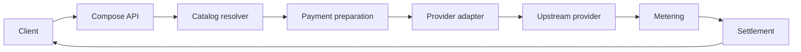

Compose.Market inference is a hosted API for model calls that need provider routing, usage metering, and payment on the same request.

You can use it two ways:

| Surface | Base path | Who it is for |
| --- | --- | --- |
| Native Compose inference | `/v1` | Clients that want x402 negotiation, Compose receipts, response retrieval, and full model metadata. |
| External OpenAI-compatible inference | `/external/v1` | IDEs and apps that already speak the OpenAI API shape and only support bearer auth. |

Both surfaces use the same generated catalog and the same provider adapters. The external surface keeps bodies OpenAI-compatible; the native surface can include Compose receipt metadata.

## How models route

Every call resolves through the generated catalog. A catalog row carries the public model ID, provider, pricing, limits, modalities, capabilities, and optional `upstreamModelId` for provider aliases.

Duplicate provider rows use public aliases instead of hidden fallback. For example:

| Public model ID | Provider selected | Provider wire model |
| --- | --- | --- |
| `gpt-5.5` | `azure` | `gpt-5.5` |
| `openai/gpt-5.5` | `openai` | `gpt-5.5` |

The model string is the contract. The client sends a public catalog ID, the engine resolves one provider row, and the adapter sends the provider wire ID.

## Core endpoints

| Method | Path | Description |
| --- | --- | --- |
| `GET` | `/v1/models` | Generated catalog used by the API. |
| `GET` | `/v1/models/all` | Extended generated catalog, when present. |
| `POST` | `/v1/models/search` | Search and filter by provider, modality, operation, streaming, context, and price. |
| `GET` | `/v1/modalities` | Modality catalogs derived from model metadata. |
| `POST` | `/v1/chat/completions` | OpenAI-shaped chat completions. |
| `POST` | `/v1/responses` | OpenAI-shaped Responses-style input and output. |
| `POST` | `/v1/embeddings` | Embeddings. |
| `POST` | `/v1/images/generations` | Image generation. |
| `POST` | `/v1/images/edits` | Image editing. |
| `POST` | `/v1/audio/speech` | Text to speech. |
| `POST` | `/v1/audio/transcriptions` | Speech to text. |
| `POST` | `/v1/videos/generations` | Video generation submission. |
| `GET` | `/v1/videos/{id}` | Video job status. |
| `GET` | `/v1/videos/{id}/stream` | Video job status over SSE. |

## External endpoints

| Method | Path | Description |
| --- | --- | --- |
| `GET` | `/external/v1/models` | OpenAI-shaped model list for external clients. |
| `POST` | `/external/v1/chat/completions` | Chat completions with Compose Key auth. |
| `POST` | `/external/v1/responses` | Responses-style calls with Compose Key auth. |
| `POST` | `/external/v1/embeddings` | Embeddings with Compose Key auth. |
| `POST` | `/external/v1/images/generations` | Image generation with Compose Key auth. |
| `POST` | `/external/v1/audio/speech` | Speech generation with Compose Key auth. |
| `POST` | `/external/v1/audio/transcriptions` | Transcription with Compose Key auth. |
| `POST` | `/external/v1/videos/generations` | Video generation with Compose Key auth. |
| `GET` | `/.well-known/opencode` | Remote OpenCode config. |

## How a request runs

The route does not pick providers by guessing from prompt text. It resolves the public model ID through the catalog, then executes the provider adapter for that row.

## Related

- [Quickstart](/inference/quickstart)
- [External clients](/inference/external-use/overview)
- [Streaming](/inference/streaming)
- [Tools](/inference/tools)
- [Metering](/inference/metering)
- [x402](/x402/introduction)
