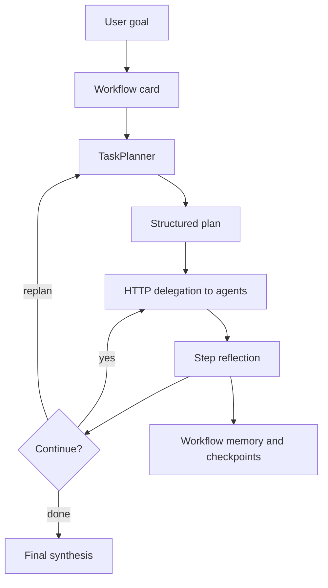

Manowar has two execution paths: an agent turn and a workflow run. Both paths use the same internal inference gateway and telemetry, but they make different control-plane choices.

In both paths, registered agents remain first-class runtime objects. A workflow can delegate to another agent, but the target is still a wallet-addressed agent with its own card model, tools, memory scope, and creator identity. Direct model calls use `models_call`; they are useful tools, not swarm participants.

## Agent Turn

```mermaid
sequenceDiagram
  participant Client
  participant API as Compose API
  participant Runtime as Manowar
  participant Memory
  participant Loop as NativeAgentExecutor
  participant Tools
  participant Model as Internal inference

  Client->>API: POST /agent/{wallet}/chat or /stream
  API->>API: prepare Compose Key or x402 payment
  API->>Runtime: internal agent request
  Runtime->>Memory: pre_turn retrieval
  Memory-->>Runtime: compact prompt context
  Runtime->>Loop: user message plus dynamic context
  Loop->>Model: /v1/chat/completions
  Model-->>Loop: assistant text or tool calls
  Loop->>Tools: execute selected tools
  Tools-->>Loop: tool results
  Loop-->>Runtime: final message plus usage
  Runtime->>Memory: post_turn persistence queued
  Runtime-->>API: output and usage
  API->>API: meter and settle
  API-->>Client: response
```

The runtime injects a dynamic system block per turn. It includes identity, optional persona text, compact memory, session context, and one capability sentence. The cached agent config is not mutated; per-request session data flows through `AsyncLocalStorage` in `harness/context.ts`.

## Workflow Run

Workflow execution lives under `runtime/src/manowar/workflow`. The orchestrator loads a workflow card, builds a coordination context, asks `TaskPlanner` for a structured plan, delegates each step to registered agents, reflects on outputs, and optionally synthesizes a final answer.



High-risk workflow steps require approval when the task text includes operations such as transfers, swaps, approvals, deletion, webhooks, or other write-like actions. The check is implemented in `workflow/orchestrator.ts`.

## Runtime Stops

The agent loop has hard stop conditions:

| Stop guard | Default | Env override |
| --- | --- | --- |
| Wall time per turn | 4 minutes | `COMPOSE_AGENT_MAX_WALL_MS_PER_TURN` |
| Consecutive failed tool batches | 4 | `COMPOSE_AGENT_MAX_TOOL_FAILURES_IN_ROW` |
| Tool batches per turn | 50 | `COMPOSE_AGENT_MAX_TOOL_BATCHES_PER_TURN` |
| Managed subagent depth | 3 | fixed in `framework.ts` |

Streaming runs also register abort controllers by run key. Stop routes can abort `run:{agentWallet}:{runId}` or fall back to `thread:{agentWallet}:{threadId}`.

## Settlement Boundary

Manowar does not price requests itself. It returns usage and structured execution evidence. The API layer owns Compose Key validation, x402 challenge handling, metering, receipt headers, and settlement.

## Related

- [Global execution](/manowar/global-execution)
- [Native observability](/manowar/native-observability-telemetry)
- [Harness checkpoints](/manowar/harness/checkpoints)
