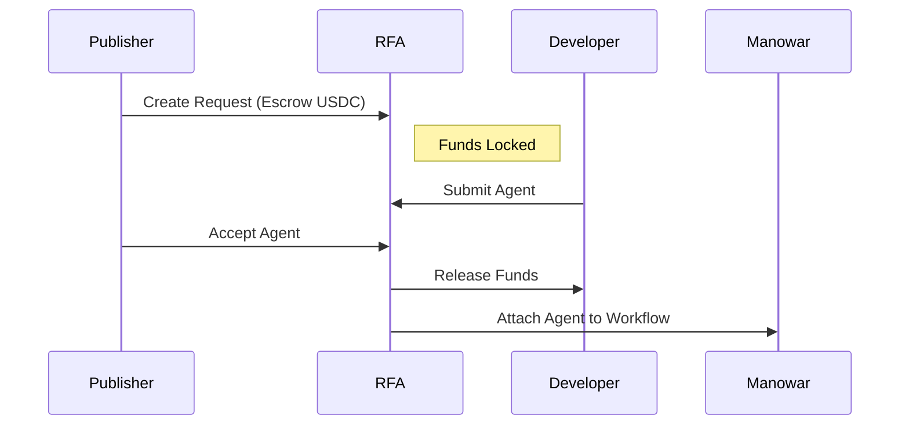

Manowar includes powerful extensions to grow the ecosystem.

## 1. Warp (Bridging)
The **Warp** contract allows agents from outside the protocol (e.g., Web2 APIs, other chains) to be "bridged" into Manowar.

*   **Mechanism**: A "Warper" creates a proxy identity for the external agent.
*   **Royalties**:
    *   **80%** goes to the Warper (for running the infrastructure/proxy).
    *   **10%** goes to the Treasury.
    *   **10%** is held for the original creator (if they claim it later).

## 2. Clone (Versioning)
The **Clone** contract allows developers to fork existing agents.
*   **Use Case**: specialized versions of generic agents (e.g., "Generic Writer" -> "Tech Blog Writer").
*   **Permissions**: Only agents marked as `cloneable` can be cloned.
*   **Inheritance**: Clones inherit the skills of the parent but can have their own price, model, and chain ID.

## 3. RFA (Request For Agent)
**Request For Agent** creates a marketplace for missing capabilities.
1.  **Request**: A workflow creator needs a specific agent type. They create an RFA and **escrow the full payment**.
2.  **Submit**: Developers build the requested agent and submit it.
3.  **Accept**: The creator accepts a submission.
4.  **Release**: The escrowed funds are released to the developer, and the agent is automatically attached to the workflow.

