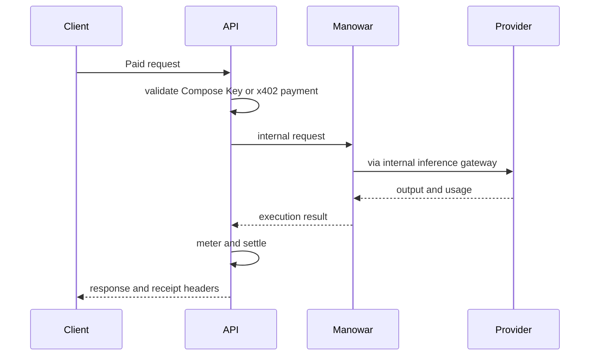

Manowar runs behind the Compose API. Public clients call API routes. The API prepares payment, forwards trusted runtime requests, and settles after execution.

The global part is not a metaphor. Agents are addressed by wallet, registered through the Compose API and card metadata, and reachable through the runtime service. When one agent delegates to another, the call crosses a service boundary with identity, memory scope, run metadata, and payment context intact.

## Boundaries

| Boundary | Owner | Notes |
| --- | --- | --- |
| Public payment | `api/` x402 and Compose Key routes | Raw x402 and Compose Key flows terminate before runtime execution. |
| Agent runtime | `runtime/src/manowar` | Runs agents, workflows, memory, tools, and telemetry. |
| Inference | `api/inference` | Manowar calls the internal `/v1/chat/completions` and `/v1/responses` routes. |
| Model search | `models.compose.market` or `MODELS_URL` | Used by `models_call` for just-in-time model selection. |
| Connector discovery | `CONNECTORS_URL` | Used by `connectors_find` and workflow registry tool discovery. |
| Storage | MongoDB, ValKey, Pinata | Memory, MAL state, proof bundles, and IPFS card data. |

## Host Modes

`RUNTIME_HOST_SCOPE=local` disables workflow runtime initialization and cloud permission enforcement. Cloud mode enforces permissions and initializes the full runtime.

| Setting | Effect |
| --- | --- |
| `RUNTIME_HOST_SCOPE=local` | Local development behavior. |
| `RUNTIME_DISABLE_TEMPORAL_WORKERS=true` | Skips Temporal worker initialization. |
| `NODE_ENV=test` or `VITEST=true` | Skips workflow worker initialization for tests. |

## Internal Calls

Manowar calls internal API routes with headers from `buildApiInternalHeaders()`. This keeps runtime-to-API calls separate from user-facing payment headers.

| Runtime operation | Internal surface |
| --- | --- |
| Model call | `POST /v1/chat/completions` |
| Responses-style call | `POST /v1/responses` |
| Agent registry check | `GET /agent/{wallet}` |
| Workflow registry check | `GET /workflow/{wallet}` |
| Agent discovery | `GET /agents/search` |
| Backpack accounts and actions | `/api/backpack/*` |

## Payment Flow

## Practical Comparison

| System | Execution boundary | Practical difference |
| --- | --- | --- |
| OpenAI Agents SDK | Your application process owns orchestration and state. | The SDK is excellent for app code; Manowar is a hosted runtime behind paid Compose routes. |
| Google ADK | Agent app owns sessions, memory, artifacts, and runners. | Manowar derives identity and scope from Compose agent/workflow metadata. |
| OpenClaw | Local gateway owns channels and sessions. | Manowar is service-side infrastructure for API-routed agents. |

## Asset Boundary

The runtime and contracts agree on the unit of composition. Runtime code validates registered agent wallets before A2A execution. Contract code mints agents with creator and license data, nests agents inside workflows, distributes creator payment from workflow composition, and supports lease-fee splits for leased workflow usage.

This lets global execution become accountable execution. A workflow can call another user's agent without absorbing it into the workflow owner's prompt. The called agent keeps its identity, and the economic layer can keep creator attribution attached to the asset.

## Related

- [x402](/x402/introduction)
- [Agent runtime endpoints](/endpoints/agents/runtime)
- [Inference](/inference/introduction)
