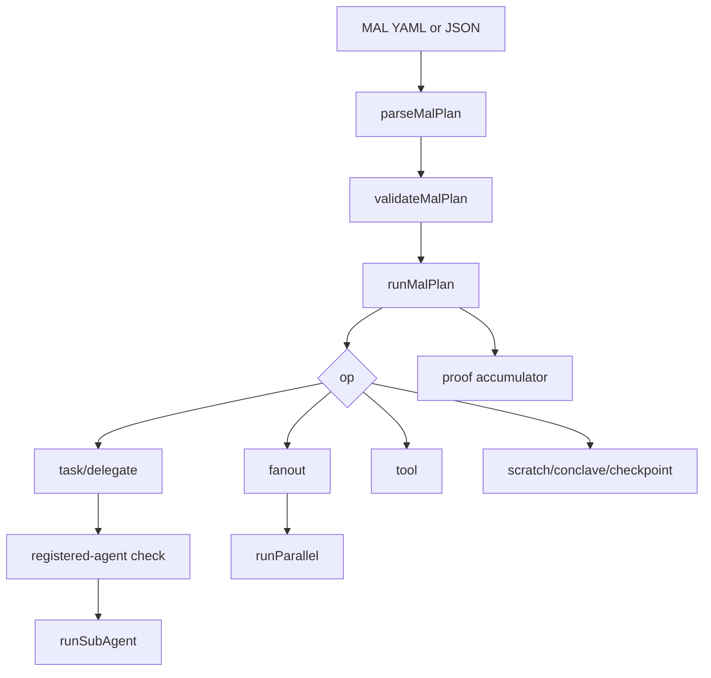

The harness is made of a small set of modules with clear jobs.



## Modules

| Module | Responsibility |
| --- | --- |
| `types.ts` | MAL plan, budget, step, subagent, result, and proof-facing types. |
| `interpreter.ts` | Parse, validate, execute, checkpoint, and proof-finalize plans. |
| `engine.ts` | Run registered subagents and enforce runtime budgets. |
| `parallel.ts` | Execute `fanout` with gather modes and concurrency caps. |
| `registry.ts` | Validate that `task` and `delegate` target registered agents. |
| `scratchpad.ts` | Private per-agent/run state. |
| `conclave.ts` | Shared swarm bus. |
| `checkpoint.ts` | ValKey checkpoint snapshots. |
| `proof.ts` | Hash proof bundles and optional IPFS pinning. |
| `sandbox.ts` | Daytona physical isolation adapter. |
| `coordinators.ts` | Dynamic coordinator pool from `/v1/models/all`. |

## Result Shape

```ts
type MalRunResult = {
  success: boolean;
  output: string;
  steps: MalStepResult[];
  stopReason: "completed" | "stop_op" | "error" | "aborted";
  aggregateUsage: {
    inputTokens: number;
    outputTokens: number;
    reasoningTokens: number;
    totalTokens: number;
    toolCalls: number;
    toolBatches: number;
    wallMs: number;
  };
  planId: string;
  proofCid?: string;
  proofUrl?: string;
};
```

## Gather Modes

| Mode | Behavior |
| --- | --- |
| `all` | Wait for every branch. Success requires every branch to succeed. |
| `any-success` | Return after the first successful branch and abort the rest. |
| `first` | Return after the first branch resolves, success or failure. |

Concurrency defaults to `4` and is capped at `16`.

## Related

- [Depth and budgets](/manowar/harness/depth-3)
- [Memory and scratchpad](/manowar/harness/memory-scratchpad)
- [Sandboxing](/manowar/harness/sandboxing)
