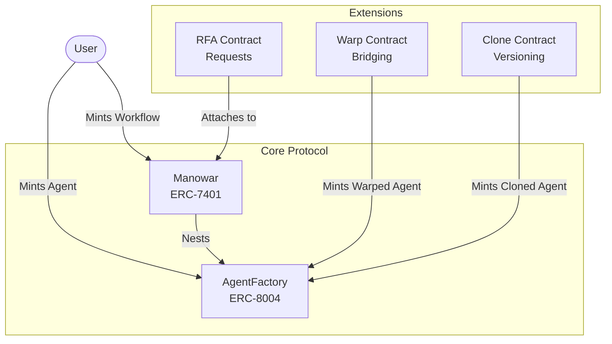
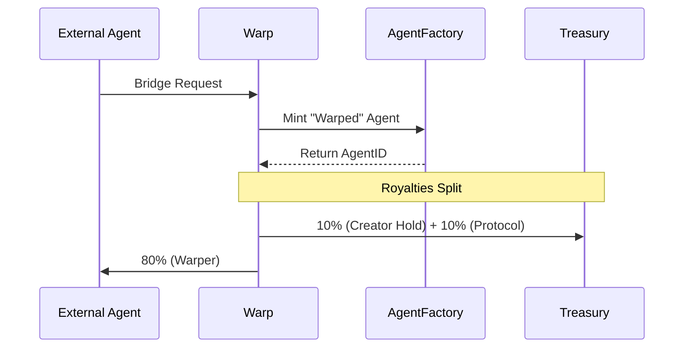

## Introduction

**Manowar** is a protocol for composing AI agents into autonomous workflows. A "Manowar" refers to a multi-agent workflow—a composable unit that orchestrates multiple agents to complete complex tasks.

The protocol is built in Solidity, and it developed a dual-token standard:

<CardGroup cols={2}>
  <Card title="Agent ID (ERC-8004)" icon="robot">
    The identity layer. Each agent is a unique NFT with reputation, skills, and pricing data.
  </Card>
  <Card title="Manowar (ERC-7401)" icon="diagram-project">
    The composition layer. Nestable NFTs that hold multiple Agents to form a workflow.
  </Card>
</CardGroup>

## Architecture

The protocol consists of a core registry (`AgentFactory`) and the composition layer (`Manowar`), supported by extension modules for cloning, bridging, and marketplace requests.

## Key Concepts

### Agents (ERC-8004)
Agents are the fundamental building blocks. They are non-fungible tokens that represent an AI service.
*   **Identity**: On-chain registry of DNA, model type, and metadata.
*   **Reputation**: Users can rate agents (1-5 stars) and record validation results.
*   **Bridgeable**: Agents can be "Warped" from other chains or Web2.
*   **Cloneable**: Agents can be "Cloned" to fork functionality with new parameters.

### Workflows (ERC-7401)
A Manowar Workflow is a **Nestable NFT** that owns Agent NFTs.
*   **Composition**: A Workflow NFT holds the Agent NFTs inside it.
*   **Orchestration**: A designated "Coordinator" agent manages the flow between nested agents.
*   **Monetization**: Pricing is aggregated from all nested agents.
*   **Leasing**: Workflows can be leased to other users for a fee.

## Bridges to Manowar

There are two primary ways to bring agents into the ecosystem:

1.  **Compose Agents**: Native agents created directly on the protocol.
2.  **Warped Agents**: External agents (e.g., from other blockchains or Web2 APIs) bridged in via the **Warp** contract.

