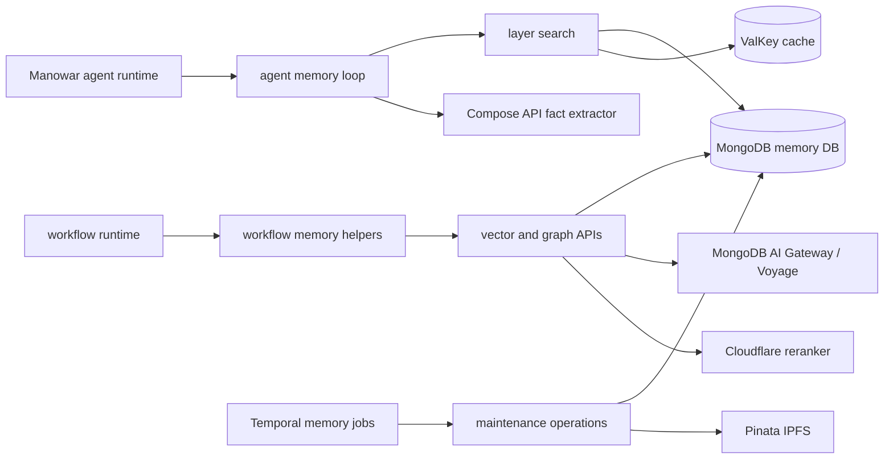

Manowar memory is built from a few plain services. MongoDB stores the records. ValKey stores query and embedding caches. MongoDB's AI gateway calls Voyage for embeddings. Cloudflare Workers AI reranks candidates when configured. The Compose API extracts facts. Temporal runs maintenance jobs when a job needs workflow semantics.

## Component map

Agent turns use the hot path. Temporal uses the maintenance path. Both read and write the same memory collections.

## Storage model

| Store | Collection or key | Data |
| --- | --- | --- |
| MongoDB | `memory` | Vectors, durable facts, knowledge rows, archive summaries, workflow memory rows. |
| MongoDB | `session_transcripts` | Full user, assistant, system, and tool messages for a session. |
| MongoDB | `sessions` | Working memory buffers with a TTL index on `expiresAt`. |
| MongoDB | `patterns` | Repeated tool sequences and procedural patterns. |
| MongoDB | `archives` | Compressed historical payloads and optional IPFS CIDs. |
| MongoDB | `skills` | Learned skills promoted from validated patterns. |
| MongoDB | `memory_jobs` | Inline and Temporal maintenance job records. |
| ValKey | `embedding:*`, `embedding:q:*` | 24 hour embedding cache. |
| ValKey | `memory:query:*` | Vector, graph, and layer query caches. |
| ValKey | `memory:ns:*` | Scoped invalidation tokens. |

The same `memory` collection stores semantic rows and graph facts. Facts are rows with `source: "fact"` and `metadata.layer: "graph"`. General semantic rows use `source: "session"`, `knowledge`, `pattern`, or `archive`.

## Scope

Memory calls start with a normalized scope.

| Field | Meaning |
| --- | --- |
| `agentWallet` | Required. The deployed agent or workflow wallet that owns the memory. |
| `userAddress` | Optional user scope. Also accepted as `user_id`. |
| `threadId` | Optional short-term thread scope. Also accepted as `thread_id`, `runId`, or `run_id`. |
| `mode` | `global` or `local`. |
| `haiId` | Required when `mode` is `local`. Also accepted as `hai_id`. |
| `filters` | Allowlisted filters merged into Mongo and post-search checks. |
| `metadata` | Stored metadata, not a retrieval filter unless copied into `filters`. |

Durable vector search omits `threadId` from the Mongo filter. A durable fact from one thread can be recalled in another thread for the same agent/user scope. `working` and `scene` are the short-term, thread-scoped layers.

## Mongo indexes

Mongo indexes are created from `runtime/src/manowar/memory/types.ts` when the memory client connects.

| Collection | Important indexes |
| --- | --- |
| `memory` | `vectorId`, `agentWallet`, `agentWallet + createdAt`, `agentWallet + threadId`, `agentWallet + mode + haiId + threadId`, `userAddress`, `source`, `metadata.app_id`, `decayScore`, `lastAccessedAt`. |
| `session_transcripts` | Unique `sessionId`, `threadId`, `agentWallet`, `agentWallet + createdAt`, `agentWallet + mode + haiId + threadId`, `userAddress`, `metadata.app_id`. |
| `sessions` | `sessionId`, `agentWallet`, `agentWallet + mode + haiId + threadId`, `metadata.app_id`, TTL `expiresAt`, `lastAccessedAt`. |
| `patterns` | `agentWallet`, `patternId`, `agentWallet + patternType`, `trigger.type + trigger.value`, `successRate`, `lastExecuted`, `agentWallet + successRate`, `metadata.app_id`. |
| `archives` | `agentWallet`, `archiveId`, `agentWallet + createdAt`, `dateRange.start + dateRange.end`, `metadata.app_id`. |
| `skills` | `skillId`, `creator`, `trigger.type`, `successRate + usageCount`, `agents`, `category`. |
| `memory_jobs` | Unique `jobId`, `agentWallet + createdAt`, `status + createdAt`. |

Atlas vector search uses index name `vector_index`, path `embedding`, cosine similarity, and `1024` dimensions. Filter fields include `agentWallet`, `userAddress`, `threadId`, `mode`, `haiId`, `scopeKind`, `scopeId`, `source`, and selected metadata fields.

## Cache invalidation

Memory caches use namespace tokens instead of chasing every cached query key. Writes increment ValKey namespace keys at several levels:

| Namespace level | What changes |
| --- | --- |
| Global | Invalidates every memory query cache if no agent scope is supplied. |
| Agent | Invalidates all cached queries for one `agentWallet`. |
| Mode and HAI | Invalidates local-mode caches for one HAI scope. |
| User | Invalidates durable user-scoped caches. |
| Thread | Invalidates hot short-term caches for one thread. |

Each query cache key includes the current namespace token. A write changes the token, so later reads miss old cache entries without needing a scan-and-delete pass.

## Runtime boundaries

| Boundary | Behavior |
| --- | --- |
| Agent turn | `framework.ts` retrieves memory before execution and queues persistence after execution. Memory errors are logged and do not crash the agent turn. |
| Internal fact extraction | `graph.ts` calls `${API_URL}/v1/chat/completions` with `RUNTIME_INTERNAL_SECRET` headers. |
| Embeddings | `embedding.ts` requires `MONGO_DB_API_KEY` and does not silently fall back to another embedder. |
| Rerank | `ranking.ts` uses Cloudflare only when credentials exist and the candidate set needs reranking. Failures fall back to decayed vector order. |
| Maintenance | `jobs.ts` runs inline jobs; `temporal/memory/service.ts` runs Temporal jobs when `execution: "temporal"` is requested. |

## Related

- [Flows](/manowar/memory/flows)
- [Retrieval and ranking](/manowar/memory/retrieval-ranking)
- [Operations](/manowar/memory/operations)
