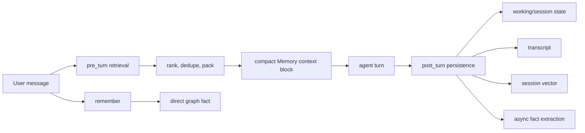

Manowar memory is the runtime memory layer for deployed Compose agents. Before a turn, it retrieves a small context block. After the turn, it stores the transcript, updates the session buffer, indexes a compact summary, and starts durable fact extraction.

The main rule is scope. Memory is keyed by the agent that owns the run, the user when present, the thread for short-term state, and the local HAI id for local execution. That lets a deployed agent remember across channels without dumping every conversation into one shared transcript.

## Runtime contract

The agent turn uses all six layers with a tight prompt budget: `limit: 12`, `maxItems: 6`, `maxItemChars: 120`, and `budget.maxCharacters: 900`. Raw memory APIs can return larger payloads for tools, admin views, and eval runs.

## Six layers

| Layer | Backing data | Retrieval shape |
| --- | --- | --- |
| `working` | Recent non-system, non-tool messages in `sessions`. | Thread-scoped, newest working context first. |
| `scene` | Full turn transcripts and summaries in `session_transcripts`. | Thread-scoped, matched by summary or recent messages. |
| `graph` | Durable extracted or explicit facts in `memory` with `source: "fact"`. | Cross-thread for the same durable agent/user scope. |
| `patterns` | Repeated tool sequences in `patterns`. | Durable procedural recall sorted by success evidence. |
| `archives` | Compressed historical memory in `archives`. | Durable cold recall over summary/content. |
| `vectors` | General semantic rows in `memory`. | Durable Atlas vector search with optional rerank and MMR. |

Short-term layers keep thread context local. Durable layers deliberately cross thread boundaries for the same agent/user scope, so an agent can remember stable facts without needing the exact same chat thread.

## Where it runs

| Runtime path | Memory behavior |
| --- | --- |
| Direct agent execution | Loads memory before the model/tool loop and queues post-turn persistence after the response. |
| Streaming agent execution | Loads the same pre-turn prompt and persists the streamed assistant text after `done`. |
| Workflow memory | Stores workflow checkpoints, evaluations, and context compaction summaries through the same vector and graph stack. |
| Memory APIs | Expose context assembly, explicit saves, item lifecycle, jobs, schedules, patterns, skills, and eval runs. |

The hot path returns text for the model. Durable and maintenance paths return metadata. The split is boring on purpose: prompts stay small, and operators still get the records they need to inspect, repair, archive, and evaluate memory.

## How it compares

| System | Public memory model | Manowar difference |
| --- | --- | --- |
| [LangGraph](https://docs.langchain.com/oss/python/concepts/memory) | Short-term graph state plus long-term stores for semantic, episodic, and procedural memory. | Manowar runs memory around deployed agents in the hosted runtime instead of limiting it to app-local graph state. |
| [OpenAI Agents SDK](https://openai.github.io/openai-agents-python/sessions/) | Sessions store conversation history between agent runs. | Manowar separates working memory, transcripts, durable facts, patterns, archives, and vectors before prompt packing. |
| [Google ADK](https://google.github.io/adk-docs/sessions/) | Sessions, state, artifacts, and memory services for application agents. | Manowar scopes memory around Compose agent wallets, users, workflow wallets, threads, and local HAI ids. |
| [CrewAI](https://docs.crewai.com/concepts/memory) | Short-term, long-term, entity, and contextual memory for crews. | Manowar exposes direct routes for item edits, conflict resolution, jobs, schedules, and evals. |
| [Mem0](https://docs.mem0.ai/) | Memory layer for user/agent facts with vector and graph-oriented retrieval. | Manowar keeps facts, vectors, transcripts, archives, and procedural patterns in the same runtime-owned storage plane. |
| [Letta](https://docs.letta.com/guides/agents/memory) | Agent memory with core and archival memory abstractions. | Manowar memory is attached to deployed Compose agents and workflow execution rather than local agent objects alone. |
| [Zep/Graphiti](https://help.getzep.com/) | Temporal knowledge graph memory for conversations and facts. | Manowar keeps graph facts beside session buffers, transcripts, patterns, archives, and prompt-budget packing. |
| [OpenClaw](https://docs.openclaw.ai/) | Local agent gateway with sessions, channels, memory, and providers. | Manowar memory runs service-side for global Compose agents and paid agent-to-agent execution. |

## Related

- [Memory architecture](/manowar/memory/architecture)
- [Memory layers](/manowar/memory/layers)
- [Retrieval and ranking](/manowar/memory/retrieval-ranking)
- [Memory flows](/manowar/memory/flows)
