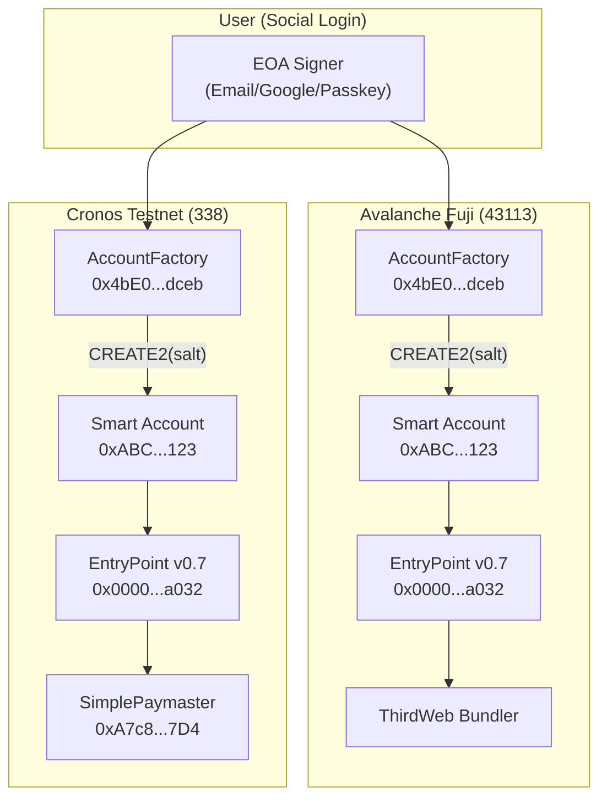
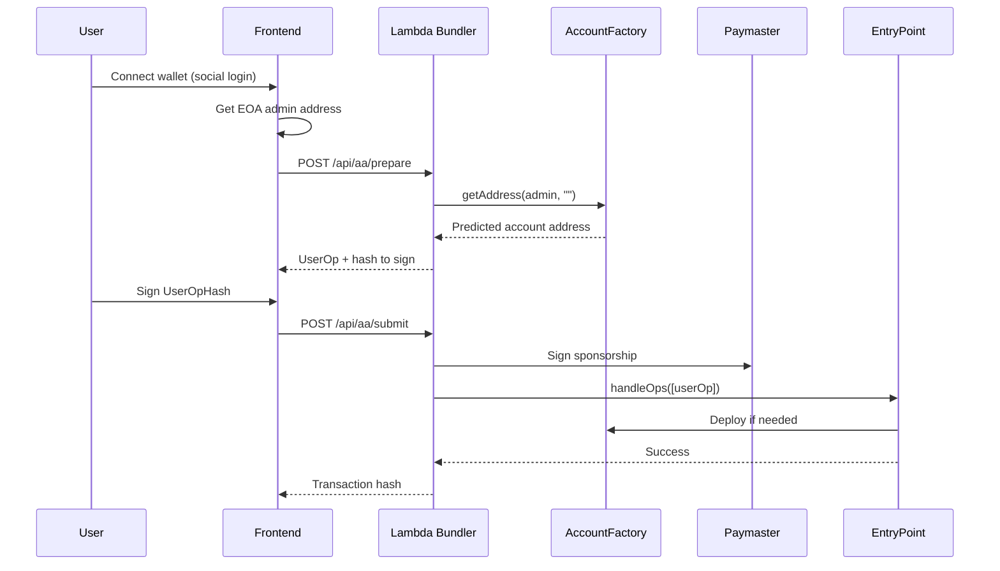

Compose.Market supports multiple EVM chains with a unified Smart Account experience. Users get the **same Smart Account address** across all supported chains through deterministic CREATE2 deployment.

---

## Cross-Chain Identity

The key innovation is **universal Smart Account addresses**. A user who creates a Smart Account on Avalanche Fuji will have the **exact same address** on Cronos Testnet.



### How It Works

The Smart Account address is derived from:

```
address = CREATE2(factory, keccak256(admin, salt), initCodeHash)
```

Since we deploy the **same AccountFactory** at the **same address** on all chains, users automatically get identical Smart Account addresses.

| Component | Requirement | Address |
|:----------|:------------|:--------|
| AccountFactory | Universal | `0x4bE0ddfebcA9A5A4a617dee4DeCe99E7c862dceb` |
| EntryPoint v0.7 | Universal | `0x0000000071727De22E5E9d8BAf0edAc6f37da032` |
| Account Implementation | Chain-specific | Varies per chain |
| Paymaster | Chain-specific | Varies per chain |

---

## Cronos Testnet Deployment

Cronos Testnet lacks a native ERC-4337 bundler, so we deployed the full AA infrastructure ourselves using CREATE2 to match ThirdWeb's universal addresses.

### Deployment Method

We extracted the deployment parameters from the original Ethereum mainnet transaction and replayed them on Cronos:

1. **Find original deployment tx** on Etherscan/Blockscout
2. **Extract CREATE2 salt** (first 32 bytes of input data)
3. **Extract init code** (remaining bytes)
4. **Call Arachnid's CREATE2 deployer** (`0x4e59b44847b379578588920cA78FbF26c0B4956C`)

This produces identical addresses on any EVM chain where Arachnid's deployer exists.

### Deployed Contracts

| Contract | Address | Notes |
|:---------|:--------|:------|
| EntryPoint v0.7 | `0x0000000071727De22E5E9d8BAf0edAc6f37da032` | Universal |
| AccountFactory | `0x4bE0ddfebcA9A5A4a617dee4DeCe99E7c862dceb` | Universal |
| Account Implementation | `0x94eC38a5d2EDA5A543Ab4c08D998338D4082beb2` | Chain-specific |
| SimplePaymaster | `0xA7c85b07aBE6eE06Cd2f1268Ea22d7156C7A67D4` | Chain-specific |

---

## Supported Chains

| Chain | Chain ID | AA Support | Payment |
|:------|:---------|:-----------|:--------|
| Avalanche Fuji | 43113 | ThirdWeb Bundler | x402 |
| Cronos Testnet | 338 | Custom (Lambda bundler) | x402 + Facilitator |

---

## Account Registration Flow

When a user connects on Cronos Testnet:



---

## API Endpoints

### `POST /api/aa/prepare`

Prepare a UserOperation for signing.

### `POST /api/aa/submit`

Submit a signed UserOperation for execution.

### `POST /api/aa/register-cronos`

Deploy a Smart Account on Cronos (if not already deployed).

---

## Key Files

| Component | Location |
|:----------|:---------|
| UserOp construction | `backend/lambda/shared/aa/userop.ts` |
| Paymaster signing | `backend/lambda/shared/aa/paymaster.ts` |
| Frontend AA client | `app/src/lib/cronos/aa.ts` |
| Cronos Facilitator | `backend/lambda/shared/config/cronos.ts` |

---

## Value for Cronos Ecosystem

This work provides **production-ready ERC-4337 v0.7 infrastructure** for Cronos Testnet:

- **Universal AccountFactory**: Same address as Ethereum, Fuji, and other chains
- **EntryPoint v0.7**: Latest standard with PackedUserOperation support
- **Gasless transactions**: SimplePaymaster for gas sponsorship
- **Cross-chain identity**: Users keep the same Smart Account address

Developers building on Cronos can reuse these contracts or follow the same CREATE2 deployment pattern.
