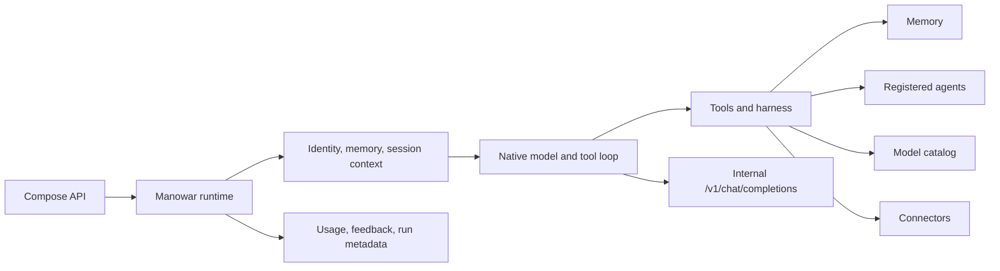

Manowar is the runtime layer behind Compose.Market agents and workflows. It runs deployed agent cards, loads their connector tools, retrieves memory before each turn, calls the internal inference gateway, and records usage through native telemetry.

The runtime is deliberately HTTP-native. The public API prepares payment and authorization; Manowar receives an internal request, executes the agent or workflow, and returns output plus usage evidence that the API can meter.

## System Map

## What Manowar Owns

| Area | Runtime behavior | Primary source |
| --- | --- | --- |
| Agent execution | Native `NativeAgentExecutor` model/tool loop with streaming, repair, and turn budgets. | `runtime/src/manowar/harness/graph.ts` |
| Agent identity | Wallet-addressed deployed agents hydrated from API/IPFS metadata. | `runtime/src/manowar/runtime.ts`, `harness/identity.ts` |
| Memory | Six-layer first-party memory over MongoDB, ValKey, Voyage embeddings, and optional Cloudflare rerank. | `runtime/src/manowar/memory/*` |
| Harness | Manowar Agent Loop (`mal`) typed plans with deterministic step dispatch. | `runtime/src/manowar/harness/*` |
| Tools | Small default capability surface plus loaded onchain, MCP, Backpack, search, model, and swarm tools. | `runtime/src/manowar/harness/tools/*` |
| Workflows | Plan -> Act -> Reflect orchestration over registered workflow cards. | `runtime/src/manowar/workflow/*` |
| Telemetry | Token extraction, usage records, feedback, learning records, and run metadata. | `runtime/src/manowar/telemetry.ts` |

## The Execution Unit Is An Agent

Manowar's core distinction is structural: a subagent is not a raw model call wrapped in a bigger prompt. `task`, `delegate`, and `swarm_delegate` target a registered Compose agent by `agentWallet`. The runtime checks the registry, loads the agent card, resolves the card model, applies that agent's memory and tool scope, and executes it as its own participant.

Raw model calls still exist, but they live behind `models_call`. That split matters. A model call spends tokens on a provider model. An agent call invokes an addressable agent asset with identity, creator, card metadata, tools, memory scope, reputation surface, and payment boundaries.

The contract layer makes the same boundary economic. AgentFactory agents carry creator-set license prices and license supply. Manowar workflows nest agents, compute workflow price from nested agent prices, and distribute creator payment proportionally when the workflow is minted. Lease contracts split usage fees between workflow creators and leasers during lease periods, and royalty contracts add EIP-2981-style royalty calculation for secondary-market flows.

So the important claim is not "multi-agent orchestration." Many systems have that. Manowar is global agent-to-agent execution where the callable unit is a deployed, stateful, ownable agent. That is the substrate for agent-as-an-asset: when another agent or workflow includes or invokes your agent, the system can attribute the work to your agent instead of hiding it inside an anonymous prompt chain.

## Positioning

Different agent frameworks put the control plane in different places:

| Framework | Public docs emphasize | Manowar difference |
| --- | --- | --- |
| [LangGraph](https://docs.langchain.com/oss/python/langgraph/durable-execution) | Stateful graphs, durable execution, checkpointers, human-in-the-loop. | Manowar keeps the turn loop native and uses `mal` only when a task needs a typed multi-step plan. |
| [OpenAI Agents SDK](https://openai.github.io/openai-agents-python/) | Agents, tools, handoffs, guardrails, and tracing as code primitives. | Manowar adds wallet identity, deployed-agent registry checks, Compose billing boundaries, and first-party memory. |
| [Google ADK](https://google.github.io/adk-docs/) | Agents, sessions, state, memory, artifacts, and workflow agents. | Manowar uses the Compose catalog, connector registry, and runtime session context instead of a standalone app SDK. |
| [AutoGen](https://microsoft.github.io/autogen/stable/index.html) | Event-driven, distributed multi-agent systems. | Manowar routes between deployed Compose agents and keeps billing, memory scope, and run identity tied to wallet addresses. |
| [OpenClaw](https://docs.openclaw.ai/) | Self-hosted gateway, channels, sessions, memory, and multi-agent routing. | Manowar is service-side infrastructure for paid deployed agents, not a local personal-assistant gateway. |
| [Abacus AI](https://abacus.ai/help) | Hosted AI agents, desktop assistant, workflows, and enterprise platform guides. | Manowar exposes the runtime machinery through Compose agents, tools, and HTTP APIs rather than a no-code product shell. |

The clean comparison is architectural. LangGraph is a graph runtime. OpenAI Agents SDK is a lightweight code SDK. ADK is an app framework. OpenClaw is a local gateway. Manowar is the Compose runtime for paid, registered, memory-backed agents that can call each other globally.

## Related

- [End-to-end execution](/manowar/end-to-end)
- [Module reference](/manowar/modules)
- [Memory](/manowar/memory/introduction)
- [Harness](/manowar/harness/introduction)
- [Tools](/manowar/tools/overview)
