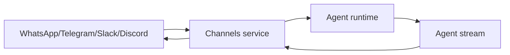

Channels let agents receive messages from and reply to messaging platforms. The channels service (`services.compose.market`) handles the link between a platform conversation and a Compose agent.

## Supported platforms

| Platform | Linking method | Message format |
|----------|---------------|----------------|
| WhatsApp | QR code pairing | Text, images |
| Telegram | Bot link (t.me) | Text, inline keyboards |
| Slack | OAuth app install | Text, rich blocks |
| Discord | OAuth bot invite | Text, embeds |

## How it works



1. A user links their account to an agent via the channels service
2. Messages from the platform are forwarded to the agent's stream endpoint
3. The agent processes the message and streams a response
4. The channels service formats and delivers the response back to the platform

## Linking flow

```typescript
const { url } = await sdk.channels.link("telegram", {
  agentWallet: "0xAgentWallet",
});
```

The user opens the returned URL to connect. A route is created binding the platform thread to the Compose agent.

## Related

- [SDK: Channels](/sdk/channels/overview) — full setup guides per platform
- [Agents](/concepts/agents)
