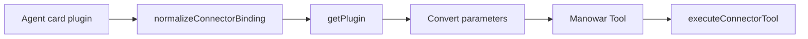

Onchain tools come from agent card plugin bindings with the `onchain` origin. Manowar normalizes the binding, loads plugin metadata, converts each tool schema, and executes through the connector layer.

## Runtime Path

The tool name is sanitized for provider function-calling compatibility, and duplicate names receive a numeric suffix. The provider sees ordinary JSON-schema function tools.

## Execution Contract

| Step | Behavior |
| --- | --- |
| Permission check | Cloud mode can require consent for sensitive actions. |
| Tool call | Runtime calls `executeConnectorTool(pluginId, toolName, args)`. |
| Failure | The tool throws a clear `connector tool ... failed` error. |
| Result | Output is compacted before returning to the agent loop. |

Pricing and settlement do not happen inside the tool module. Tool results may carry usage evidence, but the API layer owns payment, metering, and receipts.

## When To Use

Use onchain plugin tools for chain-aware actions tied to an agent's card: balances, swaps, transactions, contract reads, writes, and other wallet-bound tasks. Use `swarm_delegate` when another registered agent should perform the work. Use `models_call` when the task is a provider model call.

## Related

- [Accounts](/manowar/tools/connectors/accounts)
- [Global execution](/manowar/global-execution)
- [x402](/x402/introduction)
