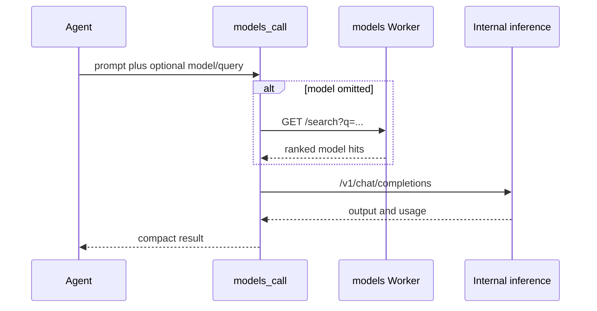

`models_call` lets an agent use the Compose model catalog for one model task. It does not create a swarm participant.

That boundary is deliberate. A registered agent has identity, memory, tools, and payment context. A model call has a `modelId`, prompt, and usage. Manowar keeps those contracts separate so A2A workflows remain agent-native while still letting agents use the full inference catalog for image, audio, embedding, classification, code, research, or synthesis work.

## Selection

`models_call` accepts either an explicit `model` or a search query:

| Field | Required | Behavior |
| --- | --- | --- |
| `prompt` | Yes | User message sent to the selected model. |
| `model` | No | Public model id to call directly. |
| `query` | No | Search text for `MODELS_URL /search` when `model` is omitted. |
| `capability` | No | Optional capability filter for model search. |

When `model` is omitted, the runtime asks the models Worker for the best match and uses the first hit. The Worker URL comes from `MODELS_URL`; local fallback is `https://models.compose.market`.

## Execution

The internal call includes Manowar metadata such as `agentWallet`, `userAddress`, and `runId` when available. That keeps usage attributable to the running agent while still treating the selected model as a tool.

## Why Models Are Not Subagents

MAL rejects `task.model` and `delegate.model`. If a plan needs another autonomous participant, it must provide `agentWallet`. If a plan needs one model output, it should call `models_call`.

| Need | Use |
| --- | --- |
| Another agent with identity, memory, tools, and creator attribution. | `task`, `delegate`, or `swarm_delegate` with `agentWallet`. |
| One direct provider/model output. | `models_call`. |
| Many model candidates for a modality or capability. | `models_call` with `query` and `capability`. |

This is one of Manowar's most important economic boundaries. A model can help an agent produce work, but a model is not credited as a marketplace agent asset.

## Related

- [Agent-to-agent](/manowar/agent-to-agent)
- [Harness A2A](/manowar/harness/a2a)
- [Inference](/inference/introduction)
