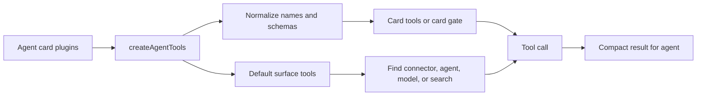

Manowar gives each agent a small default tool surface, then lets the agent discover heavier capabilities only when needed.

The default sentence injected into the prompt is intentionally short:

```text
Memory is automatic. Use card tools, harness_run, connectors_find, swarm_find, swarm_delegate, models_call, or search_call as needed.
```

That sentence is backed by real tools, not prose instructions. The runtime creates JSON-schema function tools, normalizes card-provided MCP and onchain actions, compacts large tool results, retries retryable failures, and enforces cloud permission gates when cloud mode requires them.

## Default Surface

| Tool | Purpose | Backing service |
| --- | --- | --- |
| `harness_run` | Execute one typed CAL plan. | `runtime/src/manowar/harness/*` |
| `connectors_find` | Search connector capabilities lazily. | `CONNECTORS_URL /mcps/search` |
| `swarm_find` | Search deployed Compose agents. | `API_URL /agents/search` |
| `swarm_delegate` | Delegate to one registered agent. | Manowar harness subagent execution |
| `models_call` | Select or call one model as a tool. | `MODELS_URL /search` and internal inference |
| `search_call` | Run web or deep search. | OpenAI, Gemini, or Perplexity search modes |

Card tools are loaded from the agent's plugin bindings. If an agent card declares onchain or MCP plugins, Manowar fetches those tool schemas and exposes them directly when there are only a few actions. When there are many actions, it wraps them behind a `card` gate so the prompt sees one compact selector instead of a wall of functions.

## Tool Flow



## Permission Gates

Cloud mode can require explicit permission for sensitive actions. Manowar infers common consent categories from tool names, descriptions, and errors:

| Permission | Typical trigger |
| --- | --- |
| `filesystem` | File, folder, directory, read, write, or listing tools. |
| `camera` | Photo, video capture, or camera access. |
| `microphone` | Audio recording or voice capture. |
| `geolocation` | Location, GPS, or coordinates. |
| `clipboard` | Copy/paste access. |
| `notifications` | Notification or alert tools. |

When a permission is missing, the tool returns a structured `CONSENT_REQUIRED` error instead of silently running.

## Result Compaction

Tool outputs are compacted before they go back into the agent loop. Defaults come from `AGENT_TOOL_RESULT_MAX_CHARS`, `AGENT_TOOL_RESULT_ARRAY_ITEMS`, `AGENT_TOOL_RESULT_OBJECT_KEYS`, `AGENT_TOOL_RESULT_STRING_CHARS`, and `AGENT_TOOL_RESULT_MAX_DEPTH`.

This keeps tool use practical in long runs. The agent gets the useful part of a result, plus explicit truncation metadata when a result is too large.

## Related

- [Model store](/manowar/tools/model-store)
- [MCP store](/manowar/tools/connectors/mcp-store)
- [Agent-to-agent](/manowar/agent-to-agent)
- [Harness](/manowar/harness/introduction)
