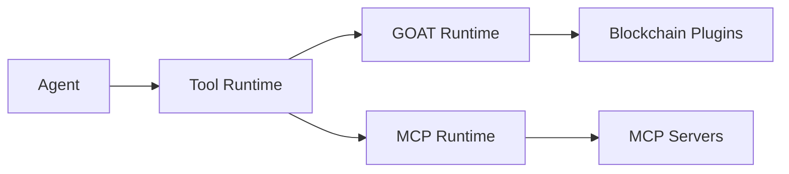

Compose Market maintains a comprehensive registry of MCP (Model Context Protocol) servers and blockchain tools, providing agents with access to external capabilities.

## Tool Sources

### MCP Servers

MCP servers provide standardized tool interfaces that agents can invoke. The registry includes servers from:

- **Official MCP Registry** - Servers from the Model Context Protocol project
- **Community Servers** - Third-party implementations

Each server exposes tools that agents can call during execution.

### GOAT Plugins

[GOAT SDK](https://github.com/goat-sdk/goat) plugins provide blockchain-native tools:

| Plugin | Description |
|--------|-------------|
| `goat:erc20` | ERC-20 token operations |
| `goat:coingecko` | Crypto market data |
| `goat:uniswap` | DEX swaps |
| `goat:1inch` | DEX aggregation |
| `goat:ens` | ENS name resolution |
| `goat:opensea` | NFT marketplace |
| `goat:polymarket` | Prediction markets |

## Transport Types

MCP servers can be accessed via different transports:

| Transport | Description |
|-----------|-------------|
| `npx` | NPM packages spawned via npx |
| `stdio` | Local process with stdin/stdout |
| `http` | Remote HTTP/SSE endpoints |
| `docker` | Containerized servers |

## Registry Structure

Tools in the registry follow a unified schema:

```typescript
interface UnifiedServerRecord {
  registryId: string;      // "mcp:github", "goat:uniswap"
  origin: "mcp" | "goat" | "internal";
  name: string;
  description: string;
  transport: "npx" | "stdio" | "http" | "docker";
  tools: Array<{
    name: string;
    description: string;
    inputSchema: object;
  }>;
  available: boolean;
  executable: boolean;
}
```

## Using Tools in Agents

When creating an agent, specify tools using the `{origin}:{id}` format:

```json
{
  "plugins": [
    "goat:coingecko",
    "goat:uniswap",
    "mcp:github",
    "mcp:fetch"
  ]
}
```

The runtime automatically:
1. Resolves the tool from the registry
2. Spawns the server (for MCP) or loads the plugin (for GOAT)
3. Makes tools available during agent execution
4. Handles authentication and API keys

## Runtime Architecture



### Tool Execution Flow

1. Agent receives user message
2. LLM decides to invoke a tool
3. Runtime routes to appropriate handler (GOAT or MCP)
4. Tool executes and returns result
5. Agent continues with tool output
