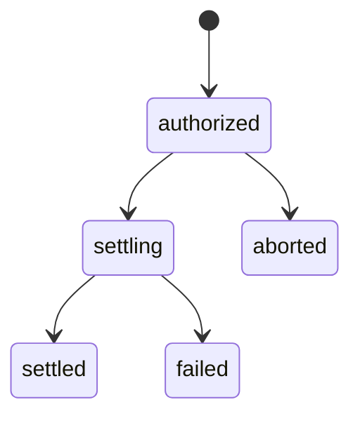

The facilitator endpoints expose the x402 pieces directly. The payment intent endpoints expose the Compose reserve-settle-abort flow used by Compose Keys and metered calls.

## x402 endpoints

| Method | Path | Purpose |
| --- | --- | --- |
| `GET` | `/api/x402/facilitator/supported` | Lists supported x402 versions, networks, and schemes. |
| `GET` | `/api/x402/facilitator/chains` | Lists configured chains, CAIP-2 network IDs, USDC addresses, explorers, and default chain ID. |
| `POST` | `/api/x402/facilitator/verify` | Verifies a payment payload against payment requirements. |
| `POST` | `/api/x402/facilitator/settle` | Settles a payment payload. |

`verify` and `settle` accept x402-shaped `paymentPayload` and `paymentRequirements` objects.

## Payment-required challenge

Raw x402 calls start with a normal request. If no valid payment is present, Compose responds with:

```http
HTTP/1.1 402 Payment Required
PAYMENT-REQUIRED: <base64-json>
Content-Type: application/json
```

The client signs the requirement and retries with:

```http
PAYMENT-SIGNATURE: <signed-payment-payload>
```

## Payment intents

| Method | Path | Purpose |
| --- | --- | --- |
| `POST` | `/api/payments/prepare` | Authorizes an exact amount, a metered quote, or a budget cap. |
| `POST` | `/api/payments/settle` | Settles an intent with a final amount or metered usage. |
| `POST` | `/api/payments/abort` | Releases a prepared intent when work fails before settlement. |
| `POST` | `/api/payments/meter/model` | Prices model usage using catalog pricing. |



## Quote model usage

```http
POST /api/payments/meter/model
Content-Type: application/json
```

```json
{
  "modelId": "gpt-5.5",
  "provider": "azure",
  "modality": "text",
  "usage": {
    "promptTokens": 1000,
    "completionTokens": 250,
    "totalTokens": 1250
  }
}
```

The response contains the resolved model, meter subject, line items, provider amount, platform fee, and final USDC atomic amount.

## Receipt headers

| Header | Meaning |
| --- | --- |
| `PAYMENT-RESPONSE` | Encoded x402 settlement response. |
| `X-Transaction-Hash` | Settlement transaction hash when available. |
| `X-Receipt` | Compose receipt with amount, network, line items, and settlement time. |
| `x-payment-intent-id` | Prepared payment intent ID. |

## Related

- [x402 introduction](/x402/introduction)
- [Compose Keys](/x402/compose-key)
- [Inference metering](/inference/metering)
