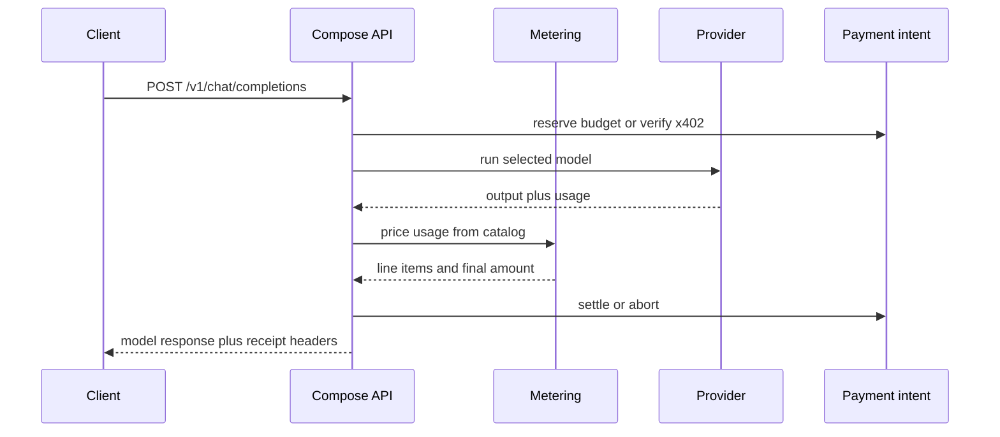

Compose.Market uses x402 for paid HTTP. The pattern is plain: a request costs money, the API asks for payment, the client pays, and the API returns the result.

For humans and IDEs, raw x402 is often too much ceremony. Compose Keys cover that case. A Compose Key is a budgeted bearer credential, so an external app can send `Authorization: Bearer compose-...` and keep using normal OpenAI-compatible HTTP.

## Pick the right flow

| Use case | Use this | Why |
| --- | --- | --- |
| OpenCode, Cline, Zed, custom OpenAI-compatible clients | Compose Key on `/external/v1/*` | These clients expect bearer auth, not a 402 challenge loop. |
| First-party app sessions | Session-purpose Compose Key | The app can reserve and settle budget without asking for a wallet signature on every call. |
| Wallet-native clients | Raw x402 on `/v1/*`, `/agent/*`, or `/workflow/*` | The client can sign `PAYMENT-REQUIRED` and retry with `PAYMENT-SIGNATURE`. |
| SDKs that want receipts in the response | Native `/v1/*` | Native routes expose Compose receipt data. External routes keep OpenAI-compatible bodies clean. |

## What happens on a paid inference call

The important detail is the order. Compose does not guess the bill from the prompt. It prices the request from provider output: token usage for text and embeddings, media evidence for image/audio/video, and the model pricing stored in the generated catalog.

## Exact vs upto

| Scheme | Meaning |
| --- | --- |
| [`exact`](https://docs.x402.org/schemes/exact) | The amount is known before execution. The client authorizes that amount. |
| [`upto`](https://docs.x402.org/schemes/upto) | The client authorizes a maximum. Compose settles the measured amount, capped by that maximum. |

Usage-priced inference uses `upto` because the final token count or media evidence is known only after the provider responds.

## Headers you will see

| Header | Direction | Meaning |
| --- | --- | --- |
| `PAYMENT-REQUIRED` | Response | Encoded x402 payment requirement for raw x402 clients. |
| `PAYMENT-SIGNATURE` | Request | Signed x402 payment payload on the retry request. |
| `Authorization` | Request | `Bearer compose-...` for Compose Key clients. |
| `X-Compose-Receipt` | Response | Base64 JSON receipt for native routes. |
| `x-payment-intent-id` | Response | Prepared payment intent used for reserve/settle/abort flows. |
| `x-compose-key-budget-remaining` | Response | Remaining key budget after settlement. |

## Native and external routes

Native routes are for Compose-aware clients. External routes are for OpenAI-compatible tools.

| Route family | Body shape | Payment | Receipt behavior |
| --- | --- | --- | --- |
| `/v1/*` | OpenAI-style plus Compose fields | Raw x402 or Compose Key | Receipts can appear in headers and native response bodies. |
| `/external/v1/*` | OpenAI-compatible | Compose Key only | Bodies stay OpenAI-shaped; Compose internals stay in headers. |

## Related

- [x402 quickstart](/x402/quickstart)
- [Compose Keys](/x402/compose-key)
- [Sessions](/x402/sessions)
- [Facilitator](/x402/facilitator)
- [Inference metering](/inference/metering)
