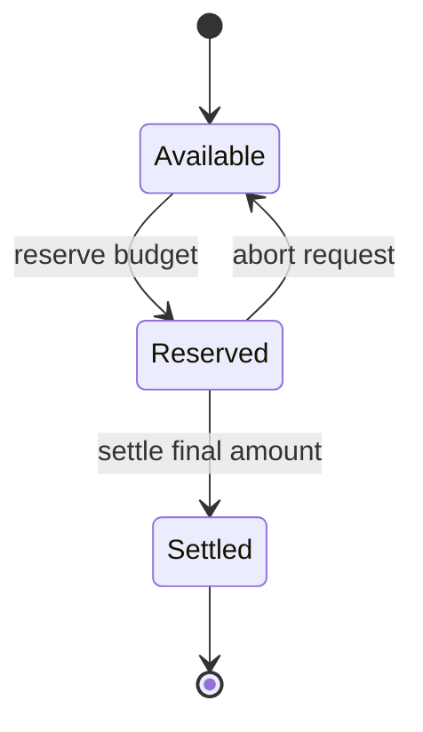

A session is a wallet budget on one chain. The API stores live budget state, reserves part of that budget before work starts, and settles or releases the reservation when the request ends.

The spendable amount is:

```text
budgetLimit - budgetUsed - budgetReserved
```

## Read session state

```http
GET /api/session
x-session-user-address: 0x...
x-chain-id: 43113
```

Active response:

```json
{
  "hasSession": true,
  "keyId": "f65a...",
  "budgetLimit": "1000000",
  "budgetUsed": "12000",
  "budgetLocked": "0",
  "budgetRemaining": "988000",
  "expiresAt": 1790000000000,
  "chainId": 43113,
  "status": {
    "isActive": true,
    "isExpired": false,
    "expiresInSeconds": 3600,
    "budgetPercentRemaining": 98.8
  }
}
```

Inactive response:

```json
{
  "hasSession": false,
  "reason": "expired"
}
```

Common reasons are `none`, `expired`, `revoked`, `budget_exhausted`, `missing_budget_state`, and `invalid_key`.

## Reserve and settle



The reservation step matters. A long streaming request can hold budget while it runs, so two parallel calls cannot spend the same remaining amount.

## Session events

```http
GET /api/session/events?userAddress=0x...&chainId=43113
```

The endpoint streams session status events over Server-Sent Events. When the active session becomes unavailable, the API sends:

```text
event: session-expired
data: {"reason":"expired","userAddress":"0x...","chainId":43113}
```

## Response headers

| Header | Meaning |
| --- | --- |
| `x-payment-method` | `session` for active session requests. |
| `x-session-budget-limit` | Total budget. |
| `x-session-budget-used` | Settled usage. |
| `x-session-budget-locked` | Reserved amount. |
| `x-session-budget-remaining` | Spendable amount left. |
| `x-session-status` | Warning such as `budget-low`, `budget-depleted`, or `expiring-soon`. |
| `x-session-invalid` | Why a session key no longer works. |

## Related

- [Compose Keys](/x402/compose-key)
- [Facilitator](/x402/facilitator)
- [x402 quickstart](/x402/quickstart)
